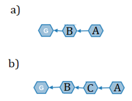

<html>


<div align="center">
<font face="cambria">
<p><a></a></p>

<p><b><font size="5">FAST ∙ SCALABLE ∙ DEVELOPER FRIENDLY</font></b></p>

<p><b><font size="5">TrustNote Cryptographic Algorithms</font></b></p>
<p><font size="5">Decentralized, Network Partition Tolerance, Minable</font></p>

<p><b>TrustNote Institute of Technology</font></b></p>
<p><font >July 2018</font></p>

</div>

<hr>

<div align="justify">

<font face="cambria" size="3">

<h1><b>Disclaimer</b></h1>
<p>TrustNote Institute of Technology and Research & Development section hereby declared that this package is under the MIT open-source software license and this software distributed without any warranty. TrustNote Institute of Technology declares that we are NOT responsible for direct, indirect, incidental, or consequential damages resulting from any defect, error, or failure to perform. This package is experimental and a work-in-progress, use at your own risk. The contents of this report are in the implementation phase, thus TrustNote can update (add/remove packages) any time without informing the users. Finally, we declare that TrustNote White paper and all other technical reports related to TrustNote only can be accessed from: </p>
<ul>
<li><p><a href="https://github.com/trustnote/document" target="_blank" rel="external">https://github.com/trustnote/document</a></p></li>
<li><p><a href="https://trustnote.org/" target="_blank" rel="external">https://trustnote.org/</a></p></li>
</ul>
<p>We do not guarantee the faulty or misleading data available in documents downloaded from any other website rather than two official websites introduced above.</P>


<h1><b>Contact Us</b></h1>
<ul>
<li><p>Business Enquiries:  <a href="foundation@trustnote.org" target="_blank" rel="external">foundation@trustnote.org</a></p></li>
<li><p>Technical Support:  <a href="community@trustnote.org" target="_blank" rel="external">community@trustnote.org</a></p></li>
</ul>

<h1>Copyright</h1>
<p>© 2018 TrustNote Institute of Technology. All rights reserved.</p>

</font>
</div>

<hr>

<div id="toc_container" align="justify">
<font face="cambria" size="3">

<h1><b>Contents</b></h1>
<ul class="toc_list">
	<p><a href="#Glossary">Glossary</a></p>
	<p><a href="#Introduction">1. Introduction</a></p>
		<ul><p><a href="#Node-Taxonomy-and-Topology">1.1. Node Taxonomy and Topology</a></p>
			<p><a href="#TrustME-PoW-Scheme-Overview">1.2. TrustME-PoW Scheme Overview</a></p>
			<p><a href="#Report-Organization">1.3. Report Organization</a></p>
		</ul>
	<p><a href="#Super-Node">2. Supernode</a></p>
		<ul><p><a href="#Motivation2">2.1. Motivation</a></p>
			<p><a href="#Methodology">2.2. Methodology</a></p>
			<p><a href="#Deposit-Mechanism">2.3. Deposit Mechanism</a></p>
		</ul>		
	<p><a href="#Main-Chain">3. Main Chain</a></p>
		<ul><p><a href="#Basic-Concept">3.1. Basic Concept</a></p>
			<p><a href="#Best-Parent-and-Main-Chain-Determination">3.2. Best Parent and Main Chain Determination</a></p>
			<p><a href="#Main-Chain-Index">3.3. Main Chain Index</a></p>
			<p><a href="#Main-Chain-Stabilization-Algorithm">3.4. Main Chain Stabilization Algorithm</a></p>
		</ul>		
	<p><a href="#TrustME-PoW-Consensus">4. TrustME-PoW Consensus</a></p>
		<ul><p><a href="#Motivation4">4.1. Motivation</a></p>
			<p><a href="#How-to-Select-Attestors">4.2. How to Select Attestors</a></p>
			<p><a href="#PoW-Unit">4.3. PoW Unit</a></p>
			<p><a href="#Consensus-Round-Switching">4.4. Consensus Round Switching</a></p>
			<p><a href="#Equihash-Difficulty-Calculation">4.5. Equihash Difficulty Calculation</a></p>
			<p><a href="#TrustME unit">4.6. TrustME unit</a></p>
			<p><a href="#Attestation Reward">4.7. Attestation Reward</a></p>
			</ul>		
	<p><a href="#Switching from Witnesses to TrustME-PoW">5. Switching from Witnesses to TrustME-PoW</a></p>
		<ul><p><a href="#Overview">5.1. Overview</a></p>
			<p><a href="#Procedure">5.2. Procedure</a></p>
		</ul>		
	<p><a href="#"></a></p>
</ul>
</font>
</div>

<hr>

<div align="justify">
<font face="cambria" size="3">

<h1><a id="Glossary"></a>Glossary</h1>

<ul>
	<li><b>Node:</b> Refers to any active user, installed TrustNote client (any devices such as phone, pc, IoT, etc.) and having a valid wallet address.</li>
	<li><b>Unit:</b> Refers to a data structure which can contain many messages generated by the nodes including Transactions messages, text messages and etc.</li>
	<li><b>Full Node:</b> Refers to Cloud Host Server/Workstation, and PC, which maintaining synchronization and verification of ledger data.</li>
	<li><b>Supernode:</b> Refers to Mining Systems, Cloud Host Server/Workstation, and PC, which generates a deposit contract and paying the deposit, and running the TrustME-PoW mining program.</li>
	<li><b>Parent Unit:</b> Refers to units generated at an earlier time and Child Units can reference them.</li>
	<li><b>Child Unit:</b> Refers to units generated at a later time and referencing one or more parent unit.</li>
	<li><b>MC:</b> Main Chain is a single chain along Parent-Child links within the DAG which is determined by applying the Parent Selection Algorithm recursively.</li>
	<li><b>MCI:</b> Main Chain Index.</li>
	<li><b>Public Attestor:</b> Refers to a Supernode, which participates in a round of consensus and successfully obtains Attestation power.</li>
	<li><b>PoW Unit:</b> Refers to the unit containing Equihash solution.</li>
	<li><b>TrustME unit:</b> Refers to the unit, used to determine the MC.</li>
	<li><b>Micro-Node:</b> Refers to the client running on Microcontrollers and Smart Cards.</li>
	<li><b>Light Node:</b> Refers to the client running on Smartphone and Tablet PC.</li>
	<li><b>Fine-grained PoW consensus:</b> Each Supernode independently starts PoW, and there is no direct bound between nodes.</li>
	<li><b>Coarse-grained PoW consensus:</b> The Supernode periodically starts PoW. Each round selects a certain number of Supernodes as Attestors. These Attestors only belong to that specific round. Once that round finished, the Attestors automatically lose their Attestation power.</li>
	<li><b>Silent-locking time (SLT):</b> Refers to the period of time when a Supernode deposit is locked in the deposit contract.</li>
</ul>

<h1><a id="Introduction"></a>1. Introduction</h1>

<p>TrustNote is a minable public DAG-ledger with an innovative, two-tier consensus mechanism designed to be "lightweight, efficient and trustworthy”. Such two-tier consensus mechanisms can improve transaction throughput and reduce transaction confirmation delay, which effectively solves the problem of “Excessive Bifurcation” and “Double Spending”. TrustME-PoW enables support for high concurrency transactions, fast transaction confirmation, and decentralized transaction unit strict sequencing mechanism. Even more, it also provides an important capability for TrustNote to support advanced declarative smart contracts and Micro-Nodes. </p>

<p>This report explains the fundamental protocols governing the TrustNote platform, such as Supernodes management protocol, Main chain selection and best parent selection, Main chain stabilization protocol, and etc. After introducing all the prerequisites, TrustME-PoW consensus mechanism will be fully explained in detail. </p>

<h2><a id="Node-Taxonomy-and-Topology"></a>1.1. Node Taxonomy and Topology</h2>

<p>The TrustNote network supports four types of nodes: Super-nodes, Full-nodes, Light-nodes, and Micro-nodes. A comparison between these four types of nodes presented in the table below. </p>

</font>
</div>

<div align="center">
<style>
table, th, td {
    border: 1px solid black;
    border-collapse: collapse;
}
th, td {
    padding: 5px;
    text-align: center;    
}
</style>

<p><b>Table 1-1 Comparison of four types of node</b></p>

<table>
  <tr>
    <th></th>
    <th>Supernode</th>
	<th>Full Node</th>
	<th>Light Node</th>
	<th>Micro Node</th>
	</tr>
  <tr>
    <td align="justify"><b>ledger</b></td>
    <td align="center">full ledger</td>
	<td align="center">full ledger</td>
	<td align="center">light ledger</td>
	<td align="center">N/A</td>
	</tr>
    <td align="justify"><b>transaction</b></td>
    <td align="center">√</td>
	<td align="center">√</td>
	<td align="center">√</td>
	<td align="center">commissioned</td>
	</tr>
	 <td align="justify"><b>DAG consensus</b></td>
    <td align="center">√</td>
	<td align="center">√</td>
	<td align="center">indirect</td>
	<td align="center">×</td>
	</tr>
	 <td align="justify"><b>TrustME-PoW</b></td>
    <td align="center">√</td>
	<td align="center">×</td>
	<td align="center">×</td>
	<td align="center">×</td>
	</tr>
	 <td align="justify"><b>TrustME-BA</b></td>
    <td align="center">√</td>
	<td align="center">×</td>
	<td align="center">×</td>
	<td align="center">×</td>
	</tr>
	 <td align="justify"><b>Hosting Micro Node</b></td>
    <td align="center">√</td>
	<td align="center">×</td>
	<td align="center">×</td>
	<td align="center">×</td>
	</tr>
	 <td align="justify"><b>deployment</b></td>
    <td align="center">Mining systems, Cloud Host Server/Workstation, PC</td>
	<td align="center">Cloud Host Server/Workstation, PC</td>
	<td align="center">Smartphone, Tablet PC</td>
	<td align="center">MCU, Smart Card</td>
	</tr>	
	</table> 	
	
</div>

<div align="justify">
<font face="cambria" size="3">

<p></p>	
	
<p><b>Figure ‎1-1 P2P network Connection diagram between nodes</b></p>

<h2><a id="TrustME-PoW-Scheme-Overview"></a>1.2. TrustME-PoW Scheme Overview</h2>

<ul>
	<li>TrustME-PoW conducted in separate rounds.</li>
	<li>Each round lasts for 150 seconds (2.5 min).</li>
	<li>Each 210,240 consensus rounds is called a consensus year.</li>
	<li>The total mining time is 20 consensus year.</li>
	<li>Decentralized selection of Attestors from Supernodes. </li>
	<li>Users who want to become Supernode need to have more than 500,000 MN, as they need TTT to pay the deposit, pay the unit fee for the PoW unit and Attestation unit as well.</li>
	<li>Users who want to become Supernodes are required to create the deposit contract and pay the deposit (500,000 MN). For convenience, different payment methods (Individual or Crowd funding) provided.</li>
	<li>Full Nodes can become Supernodes and join TrustME-PoW by paying the deposit contract. </li>
	<li>Once the silent-locking time is over, the deposited TTT will be returned to the Supernode specified payout_address. </li>
	<li>Supernodes won’t lose their deposit under any circumstances. Any malicious unit or suspicious behavior would only extend the SLT.</li>
	<li>Supernode clients are enjoying the premium package.</li>
	<li>Supernode clients will be running multi-threaded platform (Full ledger thread, Supernode thread, Attestation thread, etc.). see figure 1-3</li>
	<li>Full ledger thread is used to synchronize and verify the generated units.</li>
	<li>Supernode thread let the Supernode clients run Equihash. Once the Supernode thread finds the Equihash solution and after a specific procedure, they will receive Attestation power.</li>
	<li>Equihash solutions should satisfy the specific condition set by “Difficulty filter”. Also, difficulty filter will be adjusted by the modified version of Digishield v3/v4 algorithm.</li>
	<li>Attestation thread will be started once Supernode client can establish a stable unit (containing Equihash solution) on the MC of DAG-ledger and its result would be evaluated as the high performer.</li>
	<li>The Main Chain selection algorithm, best parent selection, and MC stabilization are triggered by the generation of each unit, to provide a high throughput for transactions confirmation while it preventing from the creation of any forks and double spending.</li>
	<li>The PoW units and other units will be stabilized after the MC is determined and stabilized.</li>
	<li>The Attestors selection protocol is triggered once the PoW units are stabilized.</li>
	<li>Attestation rewards are provided for Supernode clients who are having an active Attestation thread in a consensus round. Calculation of the rewards is according to the share of issued stable TrustME units located on MC.</li>	
	</ul>
	
</font>
</div>

<div align="center">

<p><a></a></p>	
	
<p><b>Figure 1-2 TrustME-PoW Protocol Sketch</b></p>	

<p><a></a></p>	
	
<p><b>Figure 1-3 Illustration of the underlying mechanism of TrustME-PoW</b></p>
	
</div>

<div align="justify">
<font face="cambria" size="3">

<h2><a id="Report-Organization"></a>1.3. Report Organization</h2>

<p>The remainder of this technical report is organized as follows. In chapter 2, the node taxonomy and network topology will be introduced. The Supernodes will be introduced with full details. The deposit contract and the payment method are explained as well. The procedure of becoming a Supernode is explained and Illustrated from the beginning up to a consensus round. Chapter 3 is dedicated to the Main Chain and subsequent algorithms. At first, the basic definitions like unit level, Attestation level and so on, will be presented for a better understanding. Then, it will be shown that how the best parent path (MC) is determined by childless units. The Main Chain selection algorithm among best parent paths is demonstrated afterward. The Main Chain Indexing algorithm is presented as well. Finally, it will be shown that how every single unit on the selected main chain becomes stable. The importance of Attestation units can be interpreted in this chapter. In chapter 4 the innovative TrustME-PoW consensus with all detail will be explained. Even more, the reason why we have Attestors, what Attestors are doing, how Attestors benefit from helping the maintenance of the DAG-ledger, the switching procedure between rounds and so on are carefully explained. The procedure of calculation of the rewards and the procedure of sending rewards to Attestors also explained in this chapter. The annual return rate of consensus rounds is presented in a table. Finally, in chapter 5 the required steps that TrustNote will be for the hard fork to upgrade from Witnesses mode to TrustME-PoW mode fully explained.</p>

<h1><a id="Super-Node"></a>2. Supernode</h1>
<h2><a id="Motivation2"></a>2.1. Motivation</h2>

<p>Why do we need Supernode? </p>

<ul>
	<li>Selecting the Attestors in a decentralized way.</li>
	<li>Verification and analysis of the new units.</li>
	<li>Increasing the total computing power of the whole network.</li>
	<li>The more Supernodes, the higher security of the network.</li>
	<li>Supernodes and adoption of a Coarse-grained network algorithm make the whole network, partition tolerant.</li>	
</ul>

<h2><a id="Methodology"></a>2.2. Methodology</h2>

<p>Supernodes playing a key role in verification of the transactions, selection of parent units, transaction units sequencing, and micro-node protocols and so on. In order to encourage nodes with high computing power and network resources to become Supernodes, TrustNote has a total bonus of <b>500,000,000 MN</b>. These bonuses prized during 20 years to those Supernodes that will help in the maintenance of the TrustNote DAG-ledger. The Attestation Reward Policy allocates 9.15% of Total Attestation Rewards for the first year, the dedicated Attestation Rewards decays annually according to Figure 2-1. 80% of Attestation Rewards are directly dedicated to the Supernodes who provide valid TrustME Units, 20% of Attestation Rewards are dedicated to fixed Attestor from TrustNote to support community operations, project incubation, and rewards to contributors etc.</p>

</font>
</div>

<div align="center">

<p></p>	
	
<p><b>Figure 2-1 Attenuation Chart of Attestation Rewards</b></p>
	
</div>

<div align="justify">
<font face="cambria" size="3">

<p>To become a Supernode, first it is required to download and install the Supernode client program, then create the deposit contract and pay it, also it needs to assign the address that the deposit will go to it later. It should be considered that there are two payment methods for deposit contract: the Supernode can pay the deposit by its own assets or the deposit can be funded by crowd funding methods as mining pools want. After the Supernode obtains the Attestation power (aka public Attestor), it must synchronize and verify the rapid growth of the DAG-ledger data, while participating in the competition for the next round of Attestation at the same time. Even more, it will become the agent for the micro-node in the future. Therefore, Supernodes need to have better hardware resources. Supernode resources consumption:</p>

<ul>
	<li>Synchronous DAG-ledger consumes network, memory, and hard disk I/O resources.</li>
	<li>Verification of ledger consumes CPU, memory, and hard disk I/O resources.</li>
	<li>PoW consumes RAM and CPU/GPU resources.</li>
	<li>Database operations consume hard disk I/O, CPU, and RAM resources.</li>
</ul>

<p>The figure 2-2, presented below describes the Supernodes workflow. Please, keep in mind that the work flow after step <b>"Eleven"</b> will loops back to step the <b>"Four"</b>.</p>

</div>

<div align="center">

<p></a></p>	
	
<p><b>Figure ‎2-2 Supernode workflow.</b></p>	
	
</div>

<div align="justify">
<font face="cambria" size="3">

<h2><a id="Deposit-Mechanism"></a>2.3. Deposit Mechanism</h2>

<p>The Supernode can generate normal units and TrustME units. The address of the generated TrustME unit must be the same as the one used to generate the deposit contract. There is only one Supernode address for each deposit contract. If a Supernode wants to have more than one competing Attestors’ address (such as a mining pool), it needs to generate multiple deposit contracts and pay them. By considering the safety issues of the Supernode itself and security of the network, the deposit required for the Supernode assigned as <b>500,000 MN</b>. The deposit can be paid through two different ways. The first method is that Supernode pays the deposit by its own assets. The second method is that Supernode pays the deposit through crowd funding methods.  The Supernodes who generate and pay the deposit contract can become Attestors (aka Public Attestors).</p>

<p>The main purpose of the deposit is to guarantee the trustworthy of the Supernodes if any Supernode tries to violate the rules the deposit value will be reduced; also, it reduces the malicious node's attack on the consensus mechanism. When there is sufficient number of TTT in the deposit contract address issued by a certain node, the node can immediately participate in the TrustME-PoW consensus to obtain Attestation power in certain rounds, send TrustME units and then get its Attestation rewards. In order to prevent the loss of the Supernode’s deposit and the witch attack due to hacking, the deposit has a silent-locking time when the Supernode deposit is frozen in the deposit contract. The SLT is 90 days (34,560 consensus rounds) at least. If the Supernode has not sent any TrustME unit or erroneous unit within the lock time, all the TTT in the deposit contract can be transferred to the specific address assigned by that Supernode in the deposit contract, otherwise, the SLT will be reset. </p>

<p>Supernodes are always online and vulnerable to attack. Therefore, a shorter consensus round duration should be set. If it is set to 2.5 minutes, the probability of the Attestor node being invalid or being hacked is reduced significantly. In order to improve the security of the Supernode funds, the deposit contract sets the deposit payable address and the Attestation bonus receive address. Supernode should set different addresses as the deposit payable address, payout address, and the Attestation bonus. Even more, Supernodes are required to use the cold wallet to set the reward_receiver_address to increase the security of the Supernode deposit and Attestation bonus. </p>

<h3>Deposit Contract Message</h3>

```
messages: [{
    app: 'Deposit',
    payload_location: 'inline',
    payload_hash: 'hash of payload',
    payload: {
        silent-locking time: '34,560',
        payout_address: 'Wallet Address of Node',
        reward_receiver_address: 'Wallet Address of Node'
    }
}]
```

<h1><a id="Main-Chain"></a>3. Main Chain</h1>

<p>In this section it is explained that:</p>

<ul>
	<li>What the Main Chain is and introducing some basic concepts about it.</li>
	<li>What the best parent is and how the main chain is determine.</li>
	<li>How we determine the current main chain, how we index the main chain units and what the procedure for main chain stabilization is. </li>	
</ul>

<p>TrustNote does not have a block limitation. Any node can generate a new unit (e.g. a transaction) at any time and broadcast it to other nodes. The unit can select one or more previous units as parent units, each new unit validates its own parent units and adds the parent units' hash value to its own header. In this manner, the parent-child relationship between them can be expanded into a directed acyclic graph. DAG is a finite directed graph with a topological ordering (a sequence of the vertices such that every edge is directed from earlier to later in the sequence). The Acyclic property of the graph means there is no way to start at any unit U and follow a sequence of vertices that finally loops back to U again.</p>

</font>
</div>

<div align="center">

<p><a target="_blank" href="images/TrustNote-TR-02-TrustNote simplified DAG-ledger.png"></a></p>	

<p><b>Figure 3-1 TrustNote simplified DAG-ledger</b></p>
	
</div>

<div align="justify">
<font face="cambria" size="3">

<p>Assume an attacker wants to modify a unit. The attacker will be successful if it would have the conspiracy with all other nodes to gossip the new ledger which containing the modified unit; which with the existence of honest nodes it’s impossible. Even more, assuming that the digital signature is unforgeable, the greater the number of nodes on the entire network, the more difficult it is for an attacker to tamper a unit. Consequently, it’s about to impossible for an attacker to do so.</p>

<h2><a id="Basic-Concept"></a>3.1. Basic Concept</h2>

<ul>
	<li><b>Unit Inclusion:</b> If "A" verifies "B", the unit "A" header contains the hash of the unit "B", so we say the unit "A" includes the unit "B". This inclusion relationship between the nodes is represented by a directed arrow between edges "A" and "B" on the DAG. If unit "A" includes unit "B" and the minimum path between the two units is "1", then it is said that unit "A" includes unit "B" directly; if unit "A" includes unit "B" and the minimum path between the two units is greater than "1", then unit "A" includes the unit "B" indirectly. Examples of unit inclusions are presented in figure 3-2 (a) and (b) below. </li>
	<li><b>Parent Units and Child Units:</b> If unit "A" directly includes unit "B", we say unit "A" is the child of unit "B", and unit "B" is a parent of unit "A".</li>
	<li><b>Genesis Unit:</b> The Genesis unit has no parent and is the first unit in TrustNote DAG ledger which indicated with the letter "G" in figure 3-2.</li>
	<li><b>Childless Unit:</b> The units without child are called childless units. Unit "A" in figure 3-2 is an example of a childless unit.</li>
	<li><b>Sequential Units:</b> Any two desired units are defined as sequential units if they would have a directed path connecting those units, otherwise, they are called non-sequential units. All the units sent by an Attestors from a certain address must be sequential units, otherwise, they will be eliminated from the DAG.</li>
</ul>
	
</font>
</div>

<div align="center">

<p><a target="_blank" href="images/TrustNote-TR-02-Example1.png"></a></p>	
	
<p><b>Figure 3-2 Examples of inclusion relationship between units: a) Unit "A" verifies and contains unit "B" directly Unit "B" is the parent of unit "A". b) Unit "A" contains unit "B" indirectly and unit "A" is called a childless unit.</b></p>
	
</div>

<div align="justify">
<font face="cambria" size="3">

<ul>
	<li><b>Unit Level:</b> The unit level is defined as the longest path length from that unit to Genesis unit. For instance, the Unit level of unit "A" in figure 3-2 (b) is 3</li>
	<li><b>Attestation Level:</b> To determine the Attestation Level for any unit labelled as starting unit, follow the path along best parent chain, until finding more than half of all Attestors’ Attestation unit along the path. Then calculating the unit level of the stop unit, this value is the Attestation Level of the starting unit. The Genesis unit is created by all initial Attestors, so it’s the best parent naturally. </li>
</ul>

<h2><a id="Best-Parent-and-Main-Chain-Determination"></a>3.2. Best Parent and Main Chain Determination</h2>

<p>Each unit (except Genesis unit) in DAG ledger has one or more parent units. According to a consistent algorithm, we can select the best parent units among the available parent units. The best parent unit selection algorithm is showed as below:</p>

<ul>
	<p>1. Start from a unit.</p>
	<p>2. Selecting the parent unit with the highest Attestation level as its best parent unit.</p>
	<p>3. If there are multiple candidate units, the unit with the lowest unit level will be selected as the best parent unit;</p>
	<p>4. If there are still multiple candidate units, the unit with the smallest unit hash is the best parent.</p>
</ul>

</font>
</div>


<div align="center">

<p><a target="_blank" href="images/TrustNote-TR-02-Best Parents Selection in four slides.png"></a></p>	
	
<p><b>Figure 3-3 the best parent selection explained in four slides.</b></p>
	
</div>

<div align="justify">
<font face="cambria" size="3">

<p>In this way, you can get a path starting from any Childless Unit, connecting the selected best parent units and finally reaching the Genesis Unit. This path is called the "Main Chain". As many childless units exist, there might be many "Main Chains", but the one which starts from the Childless Unit with the highest Attestation Level finally will be selected as <b>Current Main Chain</b>.</p>

<h2><a id="Main-Chain-Index"></a>3.3. Main Chain Index</h2>

<p>According to the Best Parent Unit Selection algorithm, all main chains started from childless units will merge at a point. The part from the merging point to the Genesis Unit are completely same. If any new childless units added to DAG ledger cannot change the merging point, the part of main chain from the merging point to the Genesis Unit can be called stable. All units included by the stable main chain unit directly or indirectly will be stable too. The last stable main chain unit is called the Last Stable Unit. All stable main chain units have an index, called Main Chain Index (MCI).</p>

<ul>
	<li>The MCI of the Genesis unit is 0, which increases sequentially along the stable main chain.</li>
	<li>The MCI of a normal unit is equal to the minimum MCI of the stable main chain units which include that unit.</li>
</ul>	

<p>According to MCI, we can obtain the total order of all stable units and can use this definitive total order to prevent double spending. This process is called "unit final confirmation". With the addition of new units, the stable main chain on DAG ledger will continue to grow and all related units will be confirmed.</p>
	
<h2><a id="Main-Chain-Stabilization-Algorithm"></a>3.4. Main Chain Stabilization Algorithm</h2>	
	
<p>The main chain stabilization algorithm uses the Current Main Chain as a reference to determine whether the last stable unit can be transferred to the next unit of the Current Main Chain or not. According to the child unit number of the last stable unit, this algorithm can be divided into two cases:</p>	

<h3>Case 1: The last stable unit has only one child unit</h3>

<p>If the stability of a unit is going to be determined by this method, this unit should satisfy the following condition: min<sub>AL</sub> > UL. Starting from the last unit of the current main chain and by tracing back along the Current Main Chain until more than half of the TrustME units of the Attestors of the current consensus round are meet, we have different paths and consequently several stop units {U<sub>p<sub>1</sub></sub>,…,U<sub>p<sub>n</sub></sub>} satisfying this condition. The unit with the lowest unit level U<sub>p<sub>i</sub></sub> will be selected and the minimum Attestation level of the last unit on the main chain min<sub>AL</sub> is equal to the Attestation level of U<sub>p<sub>i</sub></sub>. This procedure (simplified as much as possible) is presented in the slides below:</p>

<div align="center">

<p><a target="_blank" href="images/TrustNote-TR-02-Main Chain Stabilization Part1.png"></a></p>	

<p><a target="_blank" href="images/TrustNote-TR-02-Main Chain Stabilization Part2.png"></a></p>		
</div>

<div align="justify">
<font face="cambria" size="3">

<h3>Case 2: The last stable unit has multiple child units</h3>

<p>If these child units that are not on the current main chain, are not the best parent of the other units; they have no chance to compete for becoming a main chain unit, so we should turn back to use Case 1. otherwise,, we can get a complete alt-branch according to that best parent chain. The maximum unit level of all alt-branch units is called max<sub>UL</sub>. If max<sub>UL</sub> < min<sub>AL</sub>, we can push the last stable unit to next unit along the current main chain. Even if less than half of the other Attestors all support the alt-branch, the Attestation level of any unit on the alt-branch will not exceed max<sub>UL</sub>. Continue presenting the previous example to reach this condition as below.</p>

</font>
</div>

<div align="center">

<p><a target="_blank" href="images/TrustNote-TR-02-Main Chain Stabilization Part3.png"></a></p>	
<p><a target="_blank" href="images/TrustNote-TR-02-Main Chain Stabilization Part4.png"></a></p>	
	
</div>

<div align="justify">
<font face="cambria" size="3">

<h1><a id="TrustME-PoW-Consensus"></a>4. TrustME-PoW Consensus</h1>

<p>TrustNote adopts a two-tier consensus mechanism comprising “base consensus” and “TrustME consensus”. The base consensus, also known as “DAG consensus”, requires new units sent by nodes to verify previous units and reference them. The TrustME consensus is used to select a main chain on DAG ledger and determines the total order of all stable units based on the main chain. Such two-tier consensus mechanisms can improve transaction throughput and reduce transaction confirmation delay, thus effectively solving the problem of Excessive Bifurcation and double-spending.</p>

<h2><a id="Motivation4"></a>4.1. Motivation</h2>

<p>TrustME-PoW designed in two different types during the conceptual design phase:</p>

<ul>
	<li>Fine-grained</li>
	<li>Coarse-grained</i>
</ul>

<p>Both methods studied carefully, but in fine-grained PoW schemes, there is not any bound between Supernodes necessarily. In case of network-partitioning, as long as there are Supernodes in each partition, MC growth and stability will still be promoted, which will lead to successful confirmation of a double spent unit. To resolve this issue some attributes suggested for strengthening the bounds between the Supernodes. Eventually, it observed that nodes’ bounding that achieves a fine-grained consensus is equivalent to transforming the fine-grained consensus into a coarse-grained consensus. Therefore, in final design Coarse-grained PoW selected.</p>

<p>In addition, when the network is divided, networks with more than (n/2)  Attestors will continue to expand, and the main chain will continue to grow and stabilize over time. If in the partitioned network, the Attestors number is less than or equal to (n/2), all the units in the network will not become stable and a new round of TrustME-PoW consensus cannot be completed until the network get more than (n/2)  Attestors.</p>

<h2><a id="How-to-Select-Attestors"></a>4.2. How to Select Attestors</h2>

<p>TrustME-PoW conducted in separate rounds. Each 210,240 consensus round is called a consensus year and the total mining time is 20 consensus year. Each round lasts <b>until the next round Attestors list</b> will be completed. <b>Eight</b> Attestors will be selected in <b>each</b> round and <b>one</b> Attestor maintained by <b>TrustNote</b> will be added to the consensus round, which results in <b>nine</b> Attestors in each consensus round</p>

<p>The List of Attestors will be renewed every 150 seconds. Continuing the example in section 3.4 of this report, we will demonstrate more detail about the working mechanism of consensus round. Assuming three units in gray presented in figures below are PoW units each for one of the Attestors to take part in the next consensus round.</p>

</font>
</div>

<div align="center">

<p><a target="_blank" href="images/TrustNote-TR-02-Main Chain Stabilization Part5.png"></a></p>	
</div>

<div align="justify">
<font face="cambria" size="3">

<p>Once unit "<b>l</b>" becomes stable, at <b>T11</b> last PoW unit, unit "i" for one of the Attestors interested in taking part in next consensus round becomes stable and next consensus round starts immediately. The partial MCI order of each PoW unit becomes stable determines the priority of the Attestors in next consensus round.</p>

<p>Please note that, if an Attestor sends any double spent, invalid or wrong units it will be deprived of the Attestation power on that round and it will be removed from the list of Attestors of that round as well.</p>

<h2><a id="PoW-Unit"></a>4.3. PoW Unit</h2>

<p>For i<sup>th</sup> consensus round, the Supernode thread calculates pubSeed<sub>(i-1)</sub>,Coinbase<sub>(i-2)</sub> and pubSeed<sub>i</sub> = blake2<sub>256</sub>(pubSeed<sub>(i-1)</sub> || hash(Coinbase<sub>(i-2)</sub>) || hash(FirstStableMCUnit<sub>(i-1)</sub>)). Finally, it uses the public seed to calculate the Equihash calculation input for one Supernode n as Seed<sub>(i,n)</sub> = blake2<sub>256</sub>(pubKey<sub>n</sub>||pubSeed<sub>i</sub>), and then calculates Equihash difficulty factor "d". The difficulty factor "d" is designed and adjusted for each consensus round based on desired time of about 2.5 minutes to find the solution of Equihash. It means this parameter is a threshold and the result of solving Equihash must have a certain number of leading zeroes to be accepted. This parameter will be adjusted with respect to desired time of generating a PoW unit and it will be applied to the system smoothly.</p>

<p>Supernodes are running the Equihash Algorithm with the calculated parameters to find Equihash solutions as quick as possible. Once they find the right solution, they will generate a PoW unit containing the solution and publish it to the DAG ledger. The first eight addresses owning a stable PoW unit will obtain the Attestation power and to be an Attestor (aka Public Attestor) in the i<sup>th</sup> consensus round. If there are multiple Supernodes submitting many PoW units at the same time, the priorities are determined according to the MCI of the PoW units. If the MCI is the same, the smaller the unit hash is, the higher the priority of the Attestor it provides. In each consensus round, 8 different Supernodes corresponding to the first 8 stable PoW units will be given the Attestation Power. The first Attestor of each round is from TrustNote and the other eight Attestors will be sorted based on their PoW unit priority from 2 to 9. TrustNote fixed Attestor will be having the highest priority among others.</p>

<h3>PoW Unit</h3>

```
{
    unit: {
            version: 'Protocol Version',
            alt: ‘Alternative Currency’,
            messages: [{
                app: 'payment',
                payload_location: 'inline',
                payload_hash: 'Hash of Payload of this Transaction Message,
                payload: {
                    outputs: [{
                        { address: 'Destination Wallet Address', amount: 9989459 },
                        { address: ' Destination Wallet Address', amount: 10000 }],
                    inputs: [{
                        unit: 'Wallet Address of Origin of the Message',
                        message_index: 0,
                        output_index: 0
                    }]
                }
            }],
           messages:[{
                app: ' PoW-Equihash ',
                payload_location: ' inline ',
                payload_hash: ' hash of payload ',
                payload: {
                     round: ' round number ',
                     seed: ' string of seed ',
                     difficulty: '',
                     solution: '',
                     attestor_address: ' Wallet Address of Node '
                    }
            }]
            authors: [{
                 address: 'Attestor Address',
                 authentifiers: { r: 'Attestor Signature' }
             }],
             parent_units:['FZvSHUDsqG+TDJizrqzkNBrQUv7PDE4EwWdm68FNMuU='],
             last_ball: 'CFmFF4hnwl4eTMv4AR/45gpVZW8ty3uXEohur5oHdls=',
             last_ball_unit:'WzqSo49GLwjNE52tJ2kw32/gxnuvmCypkidkVyLnHrQ=',
             headers_commission: 60% of Total PoW unit Size,
             payload_commission: 40% of Total PoW unit Size,
             unit: 'Hash of this PoW unit'
    }
}
```

<h2><a id="Consensus-Round-Switching"></a>4.4. Consensus Round Switching</h2>

<p>The fact that consensus round switching happens is deterministic, but there are still some questions might be tickling your mind such as when the right time is to switch to next consensus rounds, or How to determine the validity of an Attestation unit and so on. The slides below (continued from section 3.4 and section 4.2) presenting additional details to answer all these questions.</p>

</font>
</div>

<div align="center">

<p><a target="_blank" href="images/TrustNote-TR-02-Main Chain Stabilization Part6.png"></a></p>
<p><a target="_blank" href="images/TrustNote-TR-02-Main Chain Stabilization Part7.png"></a></p>	
<p><a target="_blank" href="images/TrustNote-TR-02-Main Chain Stabilization Part8.png"></a></p>	
<p><a target="_blank" href="images/TrustNote-TR-02-Main Chain Stabilization Part9.png"></a></p>	
<p><a target="_blank" href="images/TrustNote-TR-02-Main Chain Stabilization Part10.png"></a></p>	
	
</div>

<div align="justify">
<font face="cambria" size="3">

<h2><a id="Equihash-Difficulty-Calculation"></a>4.5. Equihash Difficulty Calculation</h2>

</font>
</div>


<div align="center">

<p><a target="_blank" href="images/TrustNote-TR-02-Difficulty Calculation.png"></a></p>	
</div>


<div align="justify">
<font face="cambria" size="3">

<h2><a id="TrustME unit"></a>4.6. TrustME unit</h2>

<p>An Attestor can send multiple TrustME units within its consensus round. The TrustME units will be selected as the MC unit with a large probability. Each Attestor in the consensus round sending TrustME units according to their priority. To reduce the delay in confirmation of the transactions, if any of the Attestors doesn’t send the TrustME message during a certain time the next two Attestors can send the TrustME unit. (e.g. if Attestor “5” doesn’t send the TrustME unit during a certain time, the Attestor “6” and “7” will start sending units.). Once the First TrustME unit of the current round becomes stable, all the Full nodes and Supernodes need to calculate the Coinbase rewards of the previous round. The Attestors of the previous round should calculate their share of Coinbase rewards and send it to their own reward_receiver_address which will be verified by other nodes.</p>

</font>

</div>

<div align="center">
 <table>
   <TR>
      <TH><b>TrustME unit Sending Mechanism</b></TH>
   </TR>
    <TR>
      <TD>
	  <p align="justify"><b>Attestation threads</b></p>
	  <p align="justify">At any Consensus round:</p>
  <ul>
		<p align="justify">(a)	Top eight Attestors, aware of their priority joining the consensus round.</p>
		<p align="justify">(b)	First Attestor should send its first TrustME unit within 5 seconds, otherwise, it will be replaced with the next eight Attestors on the list.</p>
		<p align="justify">(c)	First Attestor on the list sends the first TrustME unit.</p>
		<p align="justify">(d)	All the Attestors should send their units with respect to their priority.</p>
		<p align="justify">(e)	Once the first TrustME unit of the current consensus round becomes stable the coinbase rewards of the previous round can be calculated. The Attestors of previous round calculate their share of coinbase rewards from the previous round and send the coinbase reward to their own reward_receiver_address, which will be verified by other nodes.</p>
		<p align="justify">(f)	The consensus round finishes and (a) will be performed again.</p>	
  </ul>  
  </TD>
   </TR>
 <table>
</div>

<div align="justify">
<font face="cambria" size="3">

<p>If TrustNote Attestor or any of eight other Attestors in the consensus round wouldn’t be available for any reason the next priority Attestor in current consensus round will immediately start sending TrustME units (e.g. if Attestor “5” is not available, the Attestor “6” start sending units).</p>

<h3>TrustME Unit</h3>

```
{
    unit: {
            version: 'Protocol Version',
            alt: ‘Alternative Currency’,
            messages: [{
                app: 'payment',
                payload_location: 'inline',
                payload_hash: 'Hash of Payload of this Transaction Message,
                payload: {
                    outputs: [{
                        {address: 'Destination Wallet Address', amount: 9989459},
                        {address: ' Destination Wallet Address', amount: 10000}],
                    inputs: [{
                        unit: 'Wallet Address of Origin of the Message',
                        message_index: 0,
                        output_index: 0
                    }]
                }
            }],
            messages: [{
                app: 'TrustME',
                payload_location: 'Inline',
                payload_hash: 'Hash of Payload',
                payload: {
                    round: 'Round Number',
                    PoW_solution: 'The PoW Unit Hash,
                    priority: 'Priority of Attestor',
	}
            }]          
            authors: [{
                address: 'Attestor Address',
                authentifiers: {r: 'Attestor Signature' }
            }],
            parent_units:['FZvSHUDsqG+TDJizrqzkNBrQUv7PDE4EwWdm68FNMuU='],
            last_ball: 'CFmFF4hnwl4eTMv4AR/45gpVZW8ty3uXEohur5oHdls=',
            last_ball_unit:'WzqSo49GLwjNE52tJ2kw32/gxnuvmCypkidkVyLnHrQ=',
             headers_commission: 60% of Total TrustME unit Size,
             payload_commission: 40% of Total TrustME unit Size,
            unit: 'Hash of this TrustME unit'
    }
}
```


<div align="justify">
<font face="cambria" size="3">


<h2><a id="Attestation Reward"></a>4.7. Attestation Reward</h2>

<p>If the TrustME unit sent by an Attestor of a consensus round is a stable unit on MC, the Attestor will receive Attestation reward and the larger the proportion of the TrustME units it sent, the more Attestation reward it might receive. In the absence of stability in the main chain, it is impossible to determine which TrustME units are on the main chain and it is not fair to calculate the Attestation bonus. Therefore, this consensus mechanism does not provide Coinbase directly (like Bitcoin) in the unit. Once the first TrustME unit of the current consensus round becomes stable on the MC the Attestors of the previous round will calculate and send their share of Coinbase reward from that specific round to their own coin base address and it should be verified by other Supernodes and full nodes. The annual Coinbase reward for each consensus round is calculated in the table below:</p>

<div align="center">
 <table>
   <TR>
      <TH><b>Year</b></TH>
	  <TH><b>Total Annual Coinbase Reward (MN)</b></TH>
	  <TH><b>The Coinbase reward for each consensus round (MN)</b></TH>
	  <TH><b>Consensus Round (From-To)</b></TH>
   </TR>
    <TR>
      <TD align="center">1</TD>
	  <TD align="center">45,745,654.16</TD>
	  <TD align="center">217.59</TD>
	  <TD align="center">1 - 210240</TD>
   </TR>
    <TR>
      <TD align="center">2</TD>
	  <TD align="center">37,157,017.22</TD>
	  <TD align="center">176.74</TD>
	  <TD align="center">210241 - 420480</TD>
   </TR>
    <TR>
      <TD align="center">3</TD>
	  <TD align="center">32,901,330.89 </TD>
	  <TD align="center">156.49</TD>
	  <TD align="center">420481 - 630720</TD>
   </TR> 
    <TR>
      <TD align="center">4</TD>
	  <TD align="center">30,180,876.28</TD>
	  <TD align="center">143.55</TD>
	  <TD align="center">630721 - 840960</TD>
   </TR>
    <TR>
      <TD align="center">5</TD>
	  <TD align="center">28,226,617.69</TD>
	  <TD align="center">134.26</TD>
	  <TD align="center">840961 - 1051200</TD>
   </TR>
    <TR>
      <TD align="center">6</TD>
	  <TD align="center">26,724,184.86</TD>
	  <TD align="center">127.11</TD>
	  <TD align="center">1051201 - 1261440</TD>
   </TR>
    <TR>
      <TD align="center">7</TD>
	  <TD align="center">25,516,460.44</TD>
	  <TD align="center">121.37</TD>
	  <TD align="center">1261440 - 1471680</TD>
   </TR>
    <TR>
      <TD align="center">8</TD>
	  <TD align="center">24,514,489.08</TD>
	  <TD align="center">116.60</TD>
	  <TD align="center">1471681 - 1681920</TD>
   </TR>
    <TR>
      <TD align="center">9</TD>
	  <TD align="center">23,663,396.98</TD>
	  <TD align="center">112.55</TD>
	  <TD align="center">1681921 - 1892160</TD>
   </TR>
    <TR>
      <TD align="center">10</TD>
	  <TD align="center">22,927,137.86</TD>
	  <TD align="center">109.05</TD>
	  <TD align="center">1892161 - 2102400</TD>
   </TR> 
    <TR>
      <TD align="center">11</TD>
	  <TD align="center">22,280,864.47</TD>
	  <TD align="center">105.98</TD>
	  <TD align="center">2102401 - 2312640</TD>
   </TR>
    <TR>
      <TD align="center">12</TD>
	  <TD align="center">21,706,783.19</TD>
	  <TD align="center">103.25</TD>
	  <TD align="center">2312641 - 2522880</TD>
   </TR>
    <TR>
      <TD align="center">13</TD>
	  <TD align="center">21,191,750.72</TD>
	  <TD align="center">100.80</TD>
	  <TD align="center">2522881 - 2733120</TD>
   </TR> 
    <TR>
      <TD align="center">14</TD>
	  <TD align="center">20,725,806.14</TD>
	  <TD align="center">98.58</TD>
	  <TD align="center">2733121 - 2943360</TD>
   </TR>
    <TR>
      <TD align="center">15</TD>
	  <TD align="center">20,301,235.29</TD>
	  <TD align="center">96.56</TD>
	  <TD align="center">2943361 - 3153600</TD>
   </TR>
    <TR>
      <TD align="center">16</TD>
	  <TD align="center">19,911,952.5</TD>
	  <TD align="center">94.71</TD>
	  <TD align="center">3153601 - 3363840</TD>
   </TR>
    <TR>
      <TD align="center">17</TD>
	  <TD align="center">19,553,079.5</TD>
	  <TD align="center">93.00</TD>
	  <TD align="center">3363841 - 3574080</TD>
   </TR>
    <TR>
      <TD align="center">18</TD>
	  <TD align="center">19,220,650.9</TD>
	  <TD align="center">91.42</TD>
	  <TD align="center">3574081 - 3784320</TD>
   </TR>
    <TR>
      <TD align="center">19</TD>
	  <TD align="center">18,911,403.55</TD>
	  <TD align="center">89.95</TD>
	  <TD align="center">3784321 - 3994560</TD>
   </TR>
    <TR>
      <TD align="center">20</TD>
	  <TD align="center">18,622,622.67</TD>
	  <TD align="center">88.58</TD>
	  <TD align="center">3994561 - 4415040</TD>
   </TR> 
    <TR>
      <TD align="center">21</TD>
	  <TD align="center">0.00</TD>
	  <TD align="center">0</TD>
	  <TD align="center">4415041 - XXXXXXX</TD>
   </TR>   
   <table>
</div>
<div align="justify">
<p>The number of TrustME units c<sub>n</sub> sent by each valid public Attestor in the i<sup>th</sup> round which became stable on the main chain and the total amount of public Attestors units C can be calculated. Finally, the portion of Attestation reward for each attestor r<sub>n</sub> and the amount of the Attestation reward for them a<sub>n</sub> can be calculated as below:</p>
</font>
</div>

<div align="center">

<p><a target="_blank" href="images/TrustNote-TR-02-Coinbase Calculation.png"></a></p>	
</div>

<div align="justify">
<font face="cambria" size="3">

<p>Please note that twenty percent of the Attestation reward in each round will be collected by the fixed Attestor of the TrustNote and it will be paid for operational costs, maintenance, R&D and so on. </p>

<p>It must be noticed that TrustNote adopts algorithms to prevent malicious behaviors of Attestors for obtaining more rewards by sending extra TrustME units out of order on the main chain. This procedure can be explained as: if an Attestor wants its TrustME unit to be considered in the calculation of the Attestation rewards, the MCI of the new unit must be greater than or equal to MCI of the previous unit posted by the Attestor plus (1/3) times the number of Attestors in that round.</p>

<h3>Coinbase Unit</h3>

```
{
    unit: {
            version: 'Protocol Version',
            alt: ‘Alternative Currency’,
            messages: [{
                app: 'payment',
                payload_location: 'inline',
                payload_hash: 'Hash of Payload of this Transaction Message,
                payload: {
                    outputs: [{
                        {address: 'Destination Wallet Address', amount: 9989459},
                        {address: ' Destination Wallet Address', amount: 10000}],
                    inputs: [{
                        unit: 'Wallet Address of Origin of the Message',
                        message_index: 0,
                        output_index: 0
                    }]
                }
            }],
            messages: [{
                app: 'Coinbase',
                payload_location: 'Inline',
                payload_hash: 'Hash of Payload',
                payload: {
	round: 'Round Number',
                    	coinbase：[
                        		{address: ‘The reward_receiver_address of The Attestor’, amount: ‘…’ MN},
                    	]
                }
            }]
            authors: [{
                address: 'Attestor Address',
                authentifiers: {r: 'Attestor Signature' }
            }],
            parent_units:['FZvSHUDsqG+TDJizrqzkNBrQUv7PDE4EwWdm68FNMuU='],
            last_ball: 'CFmFF4hnwl4eTMv4AR/45gpVZW8ty3uXEohur5oHdls=',
            last_ball_unit:'WzqSo49GLwjNE52tJ2kw32/gxnuvmCypkidkVyLnHrQ=',
             headers_commission: 60% of Total TrustME unit Size,
             payload_commission: 40% of Total TrustME unit Size,
            unit: 'Hash of this unit'
    }
}
```


<h1><a id="Switching from Witnesses to TrustME-PoW"></a>5. Switching from Witnesses to TrustME-PoW</h1>
<h2><a id="Overview"></a>5.1. Overview</h2>

<p>At a certain time, the i<sup>th</sup> round’s Attestors are on duty.</p>


</font>
</div>


<div align="center">
 <table>
   <TR>
      <TH><b>Round Number</b></TH>
	  <TH><b>Attestor</b></TH>
	  <TH><b>TrustME unit</b></TH>
   </TR>
    <TR>
      <TD align="center">i-1</TD>
	  <TD align="center">invalid</TD>
	  <TD align="center">being stable</TD>
   </TR>
    <TR>
      <TD align="center">i</TD>
	  <TD align="justify">sending TrustME units until all units in the round    (i-1) becomes stable and there are enough Attestors for the round (i+1)</TD>
	  <TD align="center">not stable</TD>
   </TR>
    <TR>
      <TD align="center">i+1</TD>
	  <TD align="justify">waiting until the first TrustME unit of round (i) to become stable, and making consensus with the seed of round (i), the Coinbase of round (i-2) and First Stable MC unit (i)</TD>
	  <TD align="center">N/A</TD>
   </TR>   
   <table>
</div>

<div align="justify">
<font face="cambria" size="3">

<p>There might be cases where the i<sup>th</sup> TrustME unit is sent after starting the (i-1)<sup>th</sup> round of TrustME. At this time, the TrustME unit of the i<sup>th</sup> round will be deemed as illegal.</p>

<h2><a id="Procedure"></a>5.2. Procedure</h2>

<p>This section gives out the list of steps about how to convert to the TrustME-PoW consensus mechanism.</p>

</font>
</div>

<div align="center">
<table>
   <TR>
      <TH><b>Round Number</b></TH>
	  <TH><b>Attestor</b></TH>
   </TR>
    <TR>
      <td align="center">1</TD>
      <td align="justify">At this point, a Hard fork will happen and the Genesis unit will be created by nine initial Attestors. One of the Attestors will be the fixed Attestor in all consensus rounds and the other eight Attestors are substitutes.</td>
   </TR>
    <TR>
      <td align="center">2</TD>
      <td align="justify">The R<sub>1</sub> consensus round  starts by the nine initial Attestors from TrustNote. They will send TrustME units.</td>   
	</TR>
    <TR>
      <td align="center">3</TD>
      <td align="justify">Once the first TrustME unit of this round (R<sub>1</sub>) becomes stable, the Supernodes proceeding to attend the R<sub>2</sub> consensus round, calculate the R<sub>2</sub>  public seed based on the public seed of the R<sub>1</sub> round and the FirstStableUnit<sub>1</sub>. The Supernodes using difficulty and node-specific seed to calculate the Equihash solution and send their PoW unit.</td>
	</TR> 
    <TR>
      <td align="center">4</TD>
      <td align="justify">Once the first eight PoW units become stable, the R<sub>2</sub>  Attestors list will be filled as: the first Attestor is the fixed Attestor from TrustNote and from index 2 to index 9 of this table will be filled based on the hash value of the PoW units of the top eight Attestors.</td>
	</TR>  	
    <TR>
      <td align="center">5</TD>
      <td align="justify">The R<sub>2</sub> round starts and the Attestors start sending the TrustME units. Once the first TrustME unit from R<sub>2</sub> becomes stable, all the full nodes and Supernodes need to calculate the Coinbase rewards for the R<sub>1</sub>. The Attestors of R<sub>1</sub> also calculate their share from the Coinbase rewards and send it to their own reward_receiver_address by generating a Coinbase unit..</td>
   </TR>
    <TR>
      <td align="center">6</TD>
      <td align="justify">Now, the Supernodes proceeding to attend the R<sub>3</sub>  consensus round, can calculate the R<sub>3</sub>  public seed based on the public seed of the R<sub>i-1</sub> (R<sub>2</sub>) round and the FirstStableUnit<sub>i-1</sub> (FirstStableUnit<sub>2</sub>) and the Coinbase of R<sub>i-2</sub>  (R<sub>1</sub>). The Supernodes using difficulty and node-specific seed to calculate the Equihash solution and send their PoW unit.</td>   
	</TR>
    <TR>
      <td align="center">7</TD>
      <td align="justify">Once the first eight PoW units become stable, the R<sub>3</sub>  Attestors list will be filled as: the first Attestor is the fixed Attestor from TrustNote and from index 2 to index 9 of this table will be filled based on the MCI of the PoW units of the top eight Attestors.</td>
	</TR> 
    <TR>
      <td align="center">8</TD>
      <td align="justify">The R<sub>3</sub> round starts and the Attestors start sending the TrustME units. Once the first TrustME unit of the R<sub>3</sub> round becomes stable, all the full nodes and Supernodes need to calculate the Coinbase rewards for the R<sub>2</sub>. The Attestors of R<sub>2</sub> also calculate their share from the Coinbase rewards and send it to their own reward_receiver_address.</td>
	</TR> 
	<table>
</div>


<div align="justify">
<font face="cambria" size="3">

<p>Eventually, all the consensus rounds after R<sub>3</sub> following the same procedure as R<sub>3</sub>.</p>

</font>
</div>

</html>
