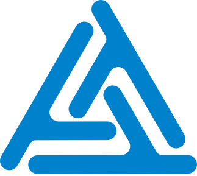
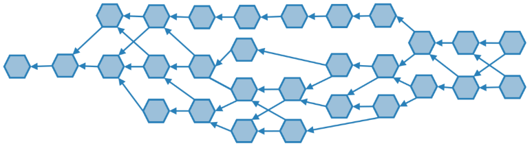
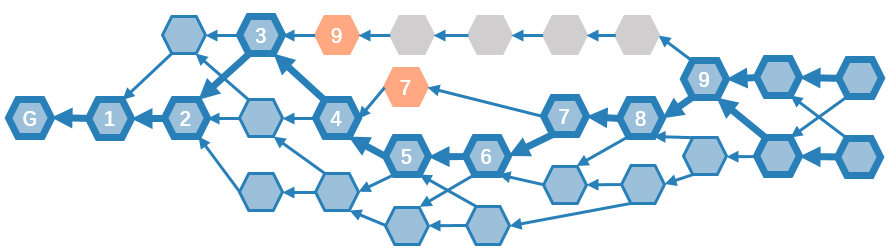

<html>

  
<h1>
<b>TrustNote Technical White Paper</b>
</h1>

<h2>
<b>TrustNote Institute of Technology</b>
</h2>

<h4>
<b>April 2018</b>
</h4>

------

<h1><b>Overview</b></h1>

The TrustNote Development Team commissioned by the TrustNote Foundation is pleased to release V1.2 of the TrustNote Technical White Paper.  This document introduces TrustNote’s background, technical characteristics, and user scenarios, it will be updated by the TrustNote Development Team from time to time to reflect evolving the advancements in design and implementation process.  For the latest information about technical white papers, software releases and technical support for developer community, please visit our official website at <a href="www.trustnote.org" target="_blank" rel="external">www.trustnote.org</a>.

<h1><b>Disclaimer</b></h1>

<!--justify-->TrustNote Institute of Technology hereby declare that: The current package is experimental and a work-in-progress, and you are using TrustNote at your own risk.  TrustNote also declares that we might change (add/remove packages) without informing the users.  In addition, because of the existence of “private equity” scams targeting crypto-currency investors, TrustNote hereby declare that participation in crypto-currency investment through unauthorized trading channels should always take precautionary measures against such risks.  Neither TrustNote Institute of Technology nor the TrustNote Development Team take responsibility for any consequences of investments via unauthorized trading channels.  Finally, we declare that, TrustNote White paper can be only accessed from:

<ul>
<li>
<a href="https://github.com/trustnote/document" target="_blank" rel="external">https://github.com/trustnote/document</a>
</li>
<li>
<a href="https://trustnote.org/" target="_blank" rel="external">https://trustnote.org/</a>
</li>
</ul>

We do not guarantee the faulty or misleading data available in documents downloaded from any other website rather than two official websites introduced above.

<b>© 2018 TrustNote Institute of Technology. All rights reserved.</b>

------

<h1><b>Contact Us</b></h1>
<ul>
<li>
Business Enquiries:  <a href="foundation@trustnote.org" target="_blank" rel="external">foundation@trustnote.org</a>
</li>
<li>
Technical Support:  <a href="community@trustnote.org" target="_blank" rel="external">community@trustnote.org</a>
</li>
</ul>

------

  
<h1><b>Abstract</b></h1>

Today’s blockchain technologies face many challenges such as network congestion, high transaction fees, and long transaction confirmation delay.  TrustNote seeks to address these problems by building the world-leading public Directed Acyclic Graph (DAG) ledger which is minable, capable of handling high concurrent transactions yet still maintain quick transaction confirmation.  TrustNote is focused on creating an easy-to-use, decentralized, low-level digital token blockchain that leverages declarative Smart Contracts with enhanced expression capability, while empowering users to create and publish digital tokens without having to write complex Smart Contracts.  TrustNote has an extensible wallet that provides security and rich API interfaces for digital tokens, blockchain games and social networks, which allowing new innovative ideas to run smoothly on the blockchain network and making user friendly blockchain applications accessible to everyone.  TrustNote has an innovative two-tier consensus mechanism and the TrustME consensus algorithms.  These algorithms are working by selecting a number of Super Nodes periodically to act as attestation authorities which they receive mining rewards according to amount of their validated attestations.

------

<h1><b>Contents</b></h1>
<ul class="toc_list">
  <li><a href="#BACKGROUND">BACKGROUND</a></li>
  <li><a href="#WHAT-IS-TRUSTNOTE?">WHAT IS TRUSTNOTE?</a></li>
    <ul><li><a href="#KEY-FEATURES">KEY FEATURES</a></li>
    <li><a href="#DIRECTED-ACYCLIC-GRAPH">DIRECTED ACYCLIC GRAPH</a></li>
    <li><a href="#COMPARISON">COMPARISON</a></li></ul>
  <li><a href="#DATA-STRUCTURES">DATA STRUCTURES</a></li>
    <ul><li><a href="#UNIT">UNIT</a></li>
    <li><a href="#MESSAGE-TYPES">MESSAGE TYPES</a></li></ul>
  <li><a href="#CONSENSUS">CONSENSUS</a></li>
    <ul><li><a href="#NODES">NODES</a></li>
    <li><a href="#UNIT-INTER-REFERENCE">UNIT INTER-REFERENCE</a></li>
    <li><a href="#MAIN-CHAIN">MAIN CHAIN</a></li>
    <li><a href="#TRANSACTION-CONFIRMATION">TRANSACTION CONFIRMATION</a></li>
    <li><a href="#TRANSACTION-FEES-AND-MINING-REWARD">TRANSACTION FEES AND MINING REWARD</a></li>
    <li><a href="#TRUSTME-POW">TRUSTME-POW</a></li>
    <li><a href="#TRUSTME-BA">TRUSTME-BA</a></li>
      <ul><li><a href="#Design-Goals">Design Goals</a></li>
      <li><a href="#Final-Consensus-and-Tentative-Consensus">Final Consensus and Tentative Consensus</a></li>
      <li><a href="#Lottery-Algorithm">Lottery Algorithm</a></li>
       <li><a href="#Byzantine-Agreement">Byzantine Agreement</a></li></ul></ul>
  <li><a href="#SMART-CONTRACT">SMART CONTRACT</a></li>
  <li><a href="#TRUSTNOTE-PLATFORM-AND-APPLICATIONS">TRUSTNOTE PLATFORM AND APPLICATIONS</a></li>
  <li><a href="#ISSUANCE-AND-DISTRIBUTION">ISSUANCE AND DISTRIBUTION</a></li>
  <li><a href="#REFERENCES">REFERENCES</a></li>
<ul>

------

  
<h1>BACKGROUND</h1>

For nearly 10 years, since January 3, 2009, Bitcoin has been operating safely, a miracle in the history of computer network technology.  The success of Bitcoin unlocked the doors to the future of the world’s economy for digital crypto-currencies; a new world full of imagination. Satoshi Nakamato creatively proposed the Blockchain - a chained data structure based on hash functions - and succeeded in building a well-operated, decentralized peer to peer network which opened the new era of digital crypto-currencies.  Blockchain technologies are developing fast, driving change across many industries, sparking innovation and creativity.

Blockchain has provided a decentralized trust mechanism and has become a brand-new paradigm and key methodology in data protection and data value exchange.  Now in its booming period, blockchain is constantly being integrated with various technologies, various scenarios are also being explored in terms of how to utilize the technical characteristics of blockchain, blockchain applications have been expanded from data tamper resistance and data value exchange to digital tokens and social-networking arenas.  The growing number of blockchain user scenarios pose many challenges for blockchain technology, demanding stronger security, higher transaction concurrency, and shorter transaction acknowledgment delay.

In Bitcoin's blockchain, all the data blocks are aligned in one continuous chain, but due to the limitations on block size and consensus mechanism, the amount of concurrent transactions is limited and transaction confirmations are slow, which resulting in the rise of transaction fees and frequent trading congestions.  To address these issues, the Bitcoin developer community has come up with solutions such as block size increases, segregated witness, and lightning networks, but none of them is perfect.  Those solutions either just ease the problem, or sacrifice security or consistency, and none of them have reached full agreement within the community.  The recent emergence of multiple bitcoin forks, has heated up the debate even further.

The structure of the ‘traditional’ blockchain is the bottleneck that hinders the technology from improving its concurrency. More efficient forms of distributed ledger technology are being sought and a solution which combines Directed Acyclic Graph (DAG) and blockchain (hereinafter referred to as "DAG-ledger") was proposed.  The DAG-ledger has no concept of blocks, so there is no limit to the size of the blocks.  In addition, DAG-ledger uses a new form of transaction verification which referencing the old transaction for transaction confirmation. This allows minor temporary differences between the users’ ledgers, to achieve the goal of preventing transaction obstruction by weakening the consistency of the entire network in a short period. The larger the network is and the greater the transaction volumes are, the shorter the transaction confirmation delay is.

IOTA and Byteball both developed their own public DAG-ledgers in 2016 to accommodate high-frequency trading scenarios.  However, the downside is that although DAG-ledger supports high-frequency trading, in the case of low-frequency trading, the old transaction cannot get enough new transactions to verify and reference, resulting in the old transaction not being confirmed in time, in extreme cases the transaction may never get confirmed.  To address this problem, IOTA proposes a temporary centralized actor called coordinator, which is used to protect the network when the volume of transactions is low, however IOTA does not disclose the design details of such coordinator; Byteball introduces 12 witnesses, implementing transaction confirmation via witness attestation, although Byteball claims its users have the right to choose their own witness, but the transaction quoting rules make it very difficult for users to change witnesses if they choose to do so. TrustNote resolved all these issues by proposing a robust and innovative design. 

<h1>WHAT IS TRUSTNOTE?</h1>

TrustNote is a minable public DAG-ledger with an innovative, two-tier consensus mechanism designed for new applications such as digital tokens issuance, blockchain games and social networks, its digital token is called “TTT”.  TrustNote's goal is to be Light, Fast, and Trust.  "Light" means TrustNote has a light architecture and intelligent contracting system that supports lightweight application extensions and micro wallets; "Fast" means TrustNote supports high concurrency transactions, enjoys fast transaction confirmation, and makes distributed application (DApp) development and deployment much easier; "Trust" means creating a platform that allows new innovative ideas to run smoothly on the ledger, and making user-friendly DApps  accessible to everyone.

<h2>Key Features</h2>
<ul>
 	<li>Two-tier consensus mechanism, a minable public DAG-ledger </li>
 	<li>Supports high concurrency transactions, benefits from fast transaction confirmation</li>
 	<li>Supports advanced declarative Smart Contracts</li>
 	<li>Token issuance system</li>
 	<li>Cryptographic Algorithm: BLAKE2, EdDSA</li>
 	<li>Multi-platform wallet, light wallet, micro wallet, support third-party extensions</li>
</ul>

<h2>Directed Acyclic Graph</h2>

A Directed Acyclic Graph (DAG), is a finite directed graph with no directed cycles. It consists of finitely many vertices and edges, with each edge directed from one vertex to another, such that there is no way to start at any vertex V and follow a consistently-directed sequence of edges that eventually loops back to V again.  The use of the DAG data structure to store ledger data is gradually getting more developers’ attention.  Projects like IOTA and Byteball have successfully established stable public-ledgers using DAG, the feasibility of a DAG-ledger is proven.

In TrustNote terms, transactions are viewed as messages. Various types of messages are supported, multiple messages can be combined into a data block which is called a “Unit”, and a DAG is formed by inter-referenced Units.  Since each Unit can reference any previous Unit or multiple previous Units, there is no need to spend more computing power and time for solving the consensus problem, nor need to wait for the completion of strong inter-node data synchronization, and because there is no need to assemble multiple Units into blocks, the performance of concurrent transactions is considerably improved and the confirmation delay are reduced to minimum.

  
<b>Figure 2-1 DAG</b>

TrustNote uses the following technique to solve the double-spending problem .  First, try to find a Main Chain (MC) starting from Genesis Unit on the DAG and assign indexes to the Units that located on the MC, the Genesis Unit’s index is 0, and so on.  Second, for those Units that do not located on the MC, define their indexes equal to the first MC Unit references this Unit.  Eventually, every transaction on the DAG has an index.  If two transactions try to use the same output, we just need to compare the value of their indexes named Main Chain Index (MCI). The Unit with a smaller index is valid, the Unit with a larger index is invalid, and thus it solves the double-spending problem.  For example, when double-spending occurs (as shown in figure 2-2), after the MCIs are assigned to each transaction, we can determine the transaction whose MCI is 8 is valid, the other transaction whose MCI is 10 is rejected.

  
<b>Figure 2-2 Main Chain (MC)</b>

  
  

For security concerns, unlike Bitcoin’s blockchain which is guaranteed by the massive computing power of the network, DAG based TrustNote relies on the fast advance of transactions and the uncertainty of the relationship between the transactions as the "firewall", which leaves the entire system looks too lawless to be attacked.  TrustNote benefits from a two-tier consensus mechanism and an innovative TrustME Consensus Algorithm. Those Super Nodes that participate in the TrustME consensus and contribute to the healthy expansion of DAG-ledger will get the mining reward.

<h2>Comparison</h2>

Standing on the shoulders of giants, absorbs the advantages of existing blockchain projects and addresses their major issues, a more prosperous TrustNote platform becomes possible.  A comparison of current well-known DAG-ledgers (IOTA and Byteball) with TrustNote is shown in Table 2-1.
  
  

<b>Table 2-1 DAG-Ledger Comparison</b>

  
| 	IOTA |	Byteball	| TrustNote |
| :---: | :---: | :---: |
Token	IOTA	Byte	TTT
Consensus Mechanism	PoW Cumulative Weight	12 Witnesses	Decentralized TrustME
Consensus Mechanism
Smart Contract	N/A	Declarative Contract	Advanced 
Declarative Contract
Reward	N/A	Transaction Reference and Attestation	Transaction Reference and Mining
Nodes	Full Node
Light Node	Full Node
Light Node	Super Node
Full Node
Light Node
Micro Node
Transaction Fee	No	Yes	Yes
Double Spending 	PoW Weight Comparison	Main Chain Sequencing	Main Chain Indexing
Low-frequency Trading	Centralized Coordinator	Weak Centralized Attestor	TrustME Attestor
 
  

</html>
