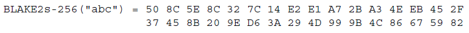

<html>
  
<div align="center">
<p><a target="_blank" href="images/TrustNote-TR-01-Cover.png"></a></p>
</div>

------

<div align="justify">
<font face="cambria" size="3">
  
 <h1><b>Disclaimer</b></h1>
<p>TrustNote Institute of Technology and Research & Development section hereby declare that, this package is under MIT open source software license and this software is distributed without any warranty. TrustNote Institute of Technology declares that we are NOT responsible for direct, indirect, incidental or consequential damages resulting from any defect, error or failure to perform. This package is experimental and a work-in-progress, use at your own risk. TrustNote R&D team can update (add/remove packages) any time without informing the users.</P>

<h1><b>Contact Us</b></h1>
<ul>
<li><p>Business Enquiries:  <a href="foundation@trustnote.org" target="_blank" rel="external">foundation@trustnote.org</a></p></li>
<li><p>Technical Support:  <a href="community@trustnote.org" target="_blank" rel="external">community@trustnote.org</a></p></li>
</ul>

<h1><b>Copyright</b></h1>
<p>© 2018 TrustNote Institute of Technology. All rights reserved.</p>

</font>
</div>

------

<div id="toc_container" align="left">
<font face="cambria" size="3">

<h1><b>Contents</b></h1>
<ul class="toc_list">
  <p><a href="#How-do-we-select-the-best-among-nominees">1. How do we select the best among nominees?</a></p>
     <ul><p><a href="#Why-Blake2">1.1. Why Blake2?</a></p>
         <p><a href="#Why-Ed25519">1.2. Why Ed25519?</a></p>  
         <p><a href="#Why-Equihash">1.3. Why Equihash?</a></p></ul>
  <p><a href="#Introduction-&-Mathematical-foundation">2. Introduction & Mathematical foundation</a></p>
     <ul><p><a href="#Blake2">2.1. Blake2</a></p>
             <ul><p><a href="#Blake2b">2.1.1. Blake2b</a></p>
             <p><a href="#Blake2s">2.1.2. Blake2s</a></p></ul>
         <p><a href="#Ed25519">2.2. Ed25519</a></p>  
         <p><a href="#Equihash">2.3. Equihash</a></p></ul>  
  <p><a href="#How-to-get-started-with-it">3. How to get started with it?</a></p>
     <ul><p><a href="#Lets-get-started-with-Blake2-Node-js-Addon">3.1. Let's get started with Blake2-Node.js-Addon</a></p>
             <ul><p><a href="#Blake2-Pure-JavaScript-Node-Addon">3.1.1. Blake2 Pure JavaScript-Node-Addon</a></p>
             <p><a href="#Blake2-C-Node-Addon">3.1.2. Blake2 C/C++ Node-Addon</a></p></ul>
         <p><a href="#Lets-get-started-with-Ed25519-Node-Addon">3.2. Let's get started with Ed25519-Node-Addon</a></p>  
         <p><a href="#Lets-get-started-with-Equihash">3.3. Let's get started with Equihash</a></p></ul>  
  <p><a href="#Discussion">4. Discussion</a></p>
  <p><a href="#References">5. References</a></p>
  <p><a href="#Appendix">Appendix</a></p>
     <ul><p><a href="#Blake2b-PureJava-test">A: Blake2b-PureJava-test</a></p>
         <p><a href="#Blake2s-PureJava-test">B: Blake2s-PureJava-test</a></p>
         <p><a href="#Blake2b-C-Node-js-Addon-test">C: Blake2b-C/C++ Node.js-Addon-test</a></p>
         <p><a href="#Blake2s-C-Node-js-Addon-test">D: Blake2s-C/C++ Node.js-Addon-test</a></p>
         <p><a href="#Ed25519-C-Node-js-Addon-test">E: Ed25519-C/C++ Node.js-Addon-test</a></p></ul>
</ul>
</font>
</div>

------

<div align="justify">
<font face="cambria" size="3">

<h1><a id="How-do-we-select-the-best-among-nominees"></a>1. How do we select the best among nominees?</h1>

<p>Selecting an efficient algorithm which also would be robust and secure while it can be performed very fast for many times per second on variety of devices is a very important and difficult process. Any failure or security hole will result in an irreparable damage. TrustNote Institute of Technology - R&D section criteria for selecting its project's cryptographic algorithms are:</p>

<ul>
  <li> High security level and Robustness </li>
  <li> Better performance</li>
  <li> Most compatible one with variety of devices</li>
</ul>

<p>So, any algorithm fits the best into these three criteria will be selected by R&D section. But it's not the end, after selecting the best available algorithm, experts in TrustNote will perform several challenging tests to verify it’s trustworthy.</p>

<h2><a id="Why-Blake2"></a>1.1. Why Blake2?</h2>

<p>Selecting an efficient, secure and fast hash function is crucial during the design process of any cryptocurrency infrastructure. A proper hash function algorithm has enough robustness so in case of encountering Collision attack, Preimage attack and etc. It should be undefeatable. A list of available hash functions presented in the table below:</p>

</font>
</div>

<div align="center">
<font face="cambria" size="3">

<TABLE>
   <TR>
      <TH ><H3> Cryptographic hash functions </H3>
      </TH>
   </TR>
   <TR>
      <TH>Column A</TH>
      <TH>Column B</TH>
   </TR>
   <TR ALIGN="CENTER">
      <TD>Data 1</TD>
      <TD>Data 2</TD>
   </TR>
</TABLE>

|| Cryptographic hash functions  ||
| :---: | :---: | :---: |
| HAVAL |	MD5 |	JH |
| Kupyna | SHA-1 | Skein |
| LM hash |	SHA-2 |	Keccak |
| MD2	| SHA-3	| CubeHash |
| MD4	| BLAKE2 | ECOH |
| MD6	| BLAKE	| ECOH |
| MDC-2	| Grøstl | FSB |


</div>


<h2><a id="Why-Ed25519"></a>1.2. Why Ed25519?</h2>
<h2><a id="Why-Equihash"></a>1.3. Why Equihash?</h2>

<h1><a id="Introduction-&-Mathematical-foundation"></a>2. Introduction & Mathematical foundation</h1>
<h2><a id="Blake2"></a>2.1. Blake2</h2>
<h3><a id="Blake2b"></a>2.1.1. Blake2b</h3>
<h3><a id="Blake2s"></a>2.1.2. Blake2s</h3>
<h2><a id="Ed25519"></a>2.2. Ed25519</h2>
<h2><a id="Equihash"></a>2.3. Equihash</h2>

<div align="justify">
<font face="cambria" size="3">

<h1><a id="How-to-get-started-with-it"></a>3. How to get started with it?</h1>

<p>In this section the packages related to each algorithm, parameters required to use them and the test results will be presented. Each subsection introducing the test vectors or testing parameters.</p>

<h2><a id="Lets-get-started-with-Blake2-Node-js-Addon"></a>3.1. Let's get started with Blake2-Node.js-Addon</h2>

<p>In this section the performance of two sets of packages created for Blake2 will be compared. These packages which are forked from other projects; one is the Pure JavaScript implementation of Blake2 and the other one is Node.js C/C++ Addon created for Blake2. The difference is crystal clear in the name, but the main differences are going to be shown in the subsections below. This package is in accordance with Blake2 RCF 7693 Standard, the final results also compared as well; more test vectors can be accessed there as well.</p>

</font>
</div>

<div align="justify">
<font face="cambria" size="3">

<h3><a id="Blake2-Pure-JavaScript-Node-Addon"></a>3.1.1. Blake2 Pure JavaScript-Node-Addon</h3>

<p>This packages which is forked and created from other projects, is tested for generating hash using Blake2b and Blake2s. A JavaScript code is created to test the performance of the package which is available at Appendix A: Blake2b-PureJava-test. The result of hashing “abc” as the input string presented below:</p>

<p>ba80a53f981c4d0d6a2797b69f12f6e94c212f14685ac4b74b12bb6fdbffa2d17d87c5392aab792dc252d5de4533cc9518d38aa8dbf1925ab92386edd4009923</p>

<p>The picture below is the test result of “<b>abc</b>” published in <a href="https://tools.ietf.org/html/rfc7693" target="_blank" rel="external">RCF 7693</a>:</p>

</font>
</div>

<div align="center">
<p><a target="_blank" href="images/TrustNote-TR-01-Blake2b-512.png"></a></p>
</div>

<div align="justify">
<font face="cambria" size="3">

<p>The result of calculating the number of hashes Blake2b - Pure JavaScript can generate: <b>219,743</b> Blake2b with the digest length of 512 bits in 5 second.</p>

<p>Performing the same test for the Blake2s, with the input vector of “<b>abc</b>” and by developing a JavaScript code available at Appendix B: Blake2s-PureJava-test.</p>

<p>508c5e8c327c14e2e1a72ba34eeb452f37458b209ed63a294d999b4c86675982</p>

<p>The picture below is the test result of “<b>abc</b>” published in <a href="https://tools.ietf.org/html/rfc7693" target="_blank" rel="external">RCF 7693</a>:</p>

</font>
</div>

<div align="center">
<p><a target="_blank" href="images/TrustNote-TR-01-Blake2s-256.png"></a></p>
</div>

<div align="justify">
<font face="cambria" size="3">

<p>The result of calculating the number of hashes Blake2s - Pure JavaScript can generate: <b>450,680</b> Blake2s with the digest length of 256 bits in 5 second.</p>

</font>
</div>

<div align="justify">
<font face="cambria" size="3">

<h3><a id="Blake2-C-Node-Addon"></a>3.1.2. Blake2 C/C++ Node-Addon</h3>

<p>This package is forked from other projects and developed to create a C/C++ Node.js Addon. The difference is JavaScript packages are slower as JavaScript is a high level programming language. The main platform in TrustNote is Node.js; therefor to have the best performance while using the basis platform, it will be required to create a C/C++ Addon. Consequently, a JavaScript code will be used as the interface and the calculation will be done in C/C++ core which this favors the performance. The performance of the same functions with the same input in this package will be presented.</p>

<p>Same as previous section the test is to create hash using Blake2b and Blake2s with the digest length of 512 and 256 respectively. A JavaScript code is created to test the performance of the package which is available at Appendix C: Blake2b-C/C++ Node.js-Addon-test.</p>

<p>The result of hashing “<b>abc</b>” as the input string presented below:</p>

<p>ba80a53f981c4d0d6a2797b69f12f6e94c212f14685ac4b74b12bb6fdbffa2d17d87c5392aab792dc252d5de4533cc9518d38aa8dbf1925ab92386edd4009923</p>

<p>The picture below is the test result of “<b>abc</b>” published in <a href="https://tools.ietf.org/html/rfc7693" target="_blank" rel="external">RCF 7693</a>:</p>

</font>
</div>

<div align="center">
<p><a target="_blank" href="images/TrustNote-TR-01-Blake2b-512.png"></a></p>
</div>

<div align="justify">
<font face="cambria" size="3">

<p>The result of calculating the number of hashes Blake2b - Pure JavaScript can generate: <b>6,605,304</b> Blake2b with the digest length of 512 bits in 5 second.</p>

<p>Performing the same test for the Blake2s, with the input vector of “abc” and by developing a JavaScript code available at Appendix D: Blake2s-C/C++ Node.js-Addon-test. </p>

<p>508c5e8c327c14e2e1a72ba34eeb452f37458b209ed63a294d999b4c86675982</p>

</font>
</div>

<div align="center">
<p><a target="_blank" href="images/TrustNote-TR-01-Blake2s-256.png"></a></p>
</div>

<div align="justify">
<font face="cambria" size="3">

<p>The result of calculating the number of hashes Blake2s - Pure JavaScript can generate: <b>7,128,410</b> Blake2s with the digest length of 256 bits in 5 second.</p>

<p>Therefore, it is crystal clear that C/C++ Addon generates <b>6,605,304</b> hashes for Blake2b and <b>7,128,410</b> hashes for Blake2s with maximum digest length while Pure JavaScript generates only <b>219,743</b> hashes for Blake2b and <b>450,680</b> hashes for Blake2s.</p>

</font>
</div>

<div align="justify">
<font face="cambria" size="3">

<h2><a id="Lets-get-started-with-Ed25519-Node-Addon"></a>3.2. Let's get started with Ed25519-Node-Addon</h2>

<p>The previous chapter showed that it's a waste of time to use Pure JavaScript packages for the project. Therefore, only the C/C++ Addon performance tested and presented for this package. The JavaScript code developed to test this package which is forked from other projects, is available at Appendix E: Ed25519-C/C++ Node.js-Addon-test. During 5 seconds, this package generates, signs and verifies 4,198 keys. This package presents an amazing performance.</p>

</font>
</div>

<div align="justify">
<font face="cambria" size="3">

<h2><a id="Lets-get-started-with-Equihash"></a>3.3. Let's get started with Equihash</h2>

<p>This package is forked from other projects. This package will be performed in C/C++ platform. This package tested with different input and, the outcomes are presented in the table below:</p>

</font>
</div>

<div>
<font face="cambria" size="3">

 | N (bits) |	K |	Seed |	Time (ms) |	Difficulty |	Solution Size (KB)	| Number of solutions found |
 | :----: | :----: | :----: | :----: | :----: | :----: | :----: |
 | 100	| 4	| 5	| 5,155 |	1	| 81,920 | 16 |
 | 100	| 4	| 20 |	15,281 | 1 |	81,920 | 16 |
 | 108	| 5	| 5	| 2,843 |	1 |	25,600 | 32 |
 | 108	| 5	| 20 |	8,499 |	1 |	25,600 | 32 |
 | 110	| 4	| 20 |	21,967 | 1 | 327,680 | 16 |
 | 110	| 4	| 5	| 22,062 | 1 |	327,680 |	16 |
 | 126	| 5	| 5	| 49,077 | 1 | 204,800 |	32 |
 | 126	| 5	| 20 |	36,797 | 1 |	204,800 |	32 |

</font>
</div>

<div align="justify">
<font face="cambria" size="3">

<h1><a id="Discussion"></a>4. Discussion</h1>

<p>This document aimed to introduce the most important subjects which directly effecting the security and performance of the final product. Eventually, TrustNote will be manipulating Blake2 as its hash function, Ed25519 as its public key generator for signing contracts and Equihash for verification. As mentioned before, this is a work-in-progress so if we find any newer and better algorithm which guarantees security of the users while offering a higher performance, we will replace it with our current packages.</p>

<h1><a id="References"></a>5. References</h1>

<ul>
<p>1. Aumasson , J.-P., Neves , S., Wilcox-O'Hearn, Z., & Winnerlein , C. (2017, 02 22). BLAKE2 — fast secure hashing. Retrieved from BLAKE2: https://Blake2.net/https://Blake2.net/</p>
<p>2. Aumasson, J.-P., Neves, S., Wilcox-O’Hearn, Z., & Winnerlein, C. (2013). BLAKE2: simpler, smaller, fast as MD5.</p>
<p>3. Bernstein, D., Duif, N., Lange, T., Schwabe, P., & Yang, B.-Y. (2011). Ed25519: high-speed high-security signatures.</p>
<p>4. Biryukov, A., & Khovratovich, D. (2016). Equihash: asymmetric proof-of-work based on the Generalized Birthday problem. LEDGER.</p>
<p>5. Chang, S.-j., Perlner, R., Burr, W., Turan, M., Kelsey, J., Paul, S., & Bassham, L. (2012). Third-Round Report of the SHA-3 Cryptographic Hash Algorithm Competition. National Institute for Standards and Technology.</p>
<p>6. Josefsson, S., & Liusvaara, I. (2017). Edwards-Curve Digital Signature Algorithm (EdDSA). Internet Research Task Force.</p>
<p>7. Langley, A., Google, Hamburg, M., Rambus Cryptography Research, & Turner, S. (2016). Edwards-Curve Digital Signature Algorithm.</p> 
<p>8. Wagner, D. (2002). A Generalized Birthday Problem. Lecture Notes in Computer Science 2442, 288–303.</p>
</u>


<h1><a id="Appendix"></a>Appendix</h1>

<h2><a id="Blake2b-PureJava-test"></a>A: Blake2b-PureJava-test</h2>

```javascript
'use strict';
var startTime = new Date().getTime();
var count = 0;
var TD = 0;
var test = require('tape')
var Blake2b = require('./Blake2b')
var util = require('./util')
var fs = require('fs')
var Blake2bHex = Blake2b.Blake2bHex
var hash = Blake2bHex('abc');
console.log('Blake2b result for input array "abc"');
console.log(hash.toString('hex'));
var endTime = new Date().getTime();
TD = endTime  - startTime;
while ((endTime  - startTime) < 5000){
    var hash = Blake2bHex('abc');
    var endTime = new Date().getTime();
    count++;}
console.log('Number of hashes generated during 5 seconds:');
console.log(count)
```

<h2><a id="Blake2s-PureJava-test"></a>B: Blake2s-PureJava-test</h2>

```javascript
'use strict';
var startTime = new Date().getTime();
var count = 0;
var TD = 0;
var test = require('tape')
var toHex = require('./util').toHex
var util = require('./util')
var b2s = require('./Blake2s')
var Blake2s = b2s.Blake2s
var Blake2sHex = b2s.Blake2sHex
var Blake2sInit = b2s.Blake2sInit
var Blake2sUpdate = b2s.Blake2sUpdate
var Blake2sFinal = b2s.Blake2sFinal
var hash = Blake2sHex('abc');
console.log('Blake2s result for input array "abc"');
console.log(hash.toString('hex'));
var endTime = new Date().getTime();
TD = endTime  - startTime;
while ((endTime  - startTime) < 5000) {
    var hash = Blake2sHex('abc');
    var endTime = new Date().getTime();
    count++;}
console.log('Number of hashes generated during 5 seconds:');
console.log(count)
```

<h2><a id="Blake2b-C-Node-js-Addon-test"></a>C: Blake2b-C/C++ Node.js-Addon-test</h2>

```javascript
'use strict';
var startTime = new Date().getTime();
var count = 0;
var TD = 0;
var
demand = require('must'),
fs        = require('fs'),
path      = require('path'),
Blake2    = require('./index');
var startTime = new Date().getTime();
var count = 0;
var TD = 0;
var assert = require('assert');
var buf = new Buffer('abc');
var hash = Blake2.sumBuffer(buf, Blake2.ALGORITHMS.B);
assert(hash instanceof Buffer);
console.log('Blake2b:');
console.log(hash.toString('hex'));
var endTime = new Date().getTime();
TD = endTime  - startTime;
while ((endTime  - startTime) < 5000) {
    var hash = Blake2.sumBuffer(buf, Blake2.ALGORITHMS.B);
    assert(hash instanceof Buffer);
    var endTime = new Date().getTime();
    count++;}
console.log('Number of hashes generated during 5 seconds:');
console.log(count)
```

<h2><a id="Blake2s-C-Node-js-Addon-test"></a>D: Blake2s-C/C++ Node.js-Addon-test</h2>

```javascript
'use strict';
var startTime = new Date().getTime();
var count = 0;
var TD = 0;
var assert = require('assert');
var buf = new Buffer('abc');
var hash2 = Blake2.sumBuffer(buf, Blake2.ALGORITHMS.S);
assert(hash2 instanceof Buffer);
console.log('Blake2s:');
console.log(hash2.toString('hex'));
var endTime = new Date().getTime();
TD = endTime  - startTime;
while ((endTime  - startTime) < 5000) {
    var hash2 = Blake2.sumBuffer(buf, Blake2.ALGORITHMS.S);
    assert(hash2 instanceof Buffer);
    var endTime = new Date().getTime();
    count++;}
console.log('Number of hashes generated during 5 seconds:');
console.log(count)
```

<h2><a id="Ed25519-C-Node-js-Addon-test"></a>E: Ed25519-C/C++ Node.js-Addon-test</h2>

```javascript
'use strict';
var test = require('tape')
var ed = require('./')
var bindings = require('./build/Release/supercop.node')
var startTime = new Date().getTime();
var count = 0;
var TD = 0;
test('generate, sign, and verify', function (t) {
  var endTime = new Date().getTime();
  TD = endTime  - startTime;
  while ((endTime  - startTime) < 5000) {
  t.plan(7)
  var seed = ed.createSeed()
  t.equal(seed.length, 32)
  var kp = ed.createKeyPair(seed)
  t.equal(kp.publicKey.length, 32)
  t.equal(kp.secretKey.length, 64)
  var msg = 'whatever'
  var sig = ed.sign(msg, kp.publicKey, kp.secretKey)
  var xsig = xmod(sig)
  var xmsg = xmod(msg)
  var xpk = xmod(kp.publicKey)
  t.ok(ed.verify(sig, msg, kp.publicKey))
  t.notOk(ed.verify(xsig, msg, kp.publicKey))
  t.notOk(ed.verify(sig, xmsg, kp.publicKey))
  t.notOk(ed.verify(sig, msg, xpk))
  var endTime = new Date().getTime();
  count++;}
console.log('Number of hashes generated during 5 seconds:');
console.log(count)
})
function xmod (buf) {
  var cp = Buffer(buf)
  cp[0] = ~cp[0]
  return cp}
```

</font>
</div>
</html>


