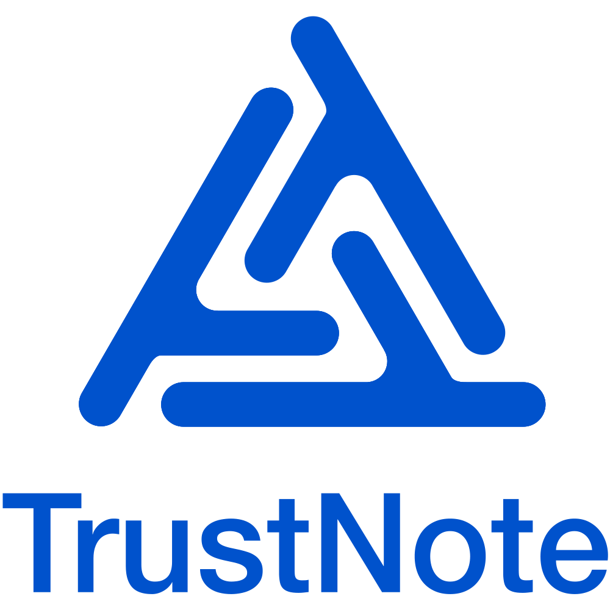

<html>
  

<b>FAST ∙ SCALABLE ∙ DEVELOPER FRIENDLY</b>

<b>Decentralized Two-tier Consensus Mechanism</b>

<b>TrustNote Institute of Technology</b>

August 2018

TrustNote Institute of Technology and Research & Development section hereby declared that the contents of this report are in R&D and implementation phase, thus TrustNote can update (add/remove packages) any time without informing the users. Finally, we declare that TrustNote white paper and all other technical reports related to TrustNote only can be accessed from:

<ul>
<li>
<a href="https://github.com/trustnote/document" target="_blank" rel="external">https://github.com/trustnote/document</a>
</li>
<li>
<a href="https://trustnote.org/" target="_blank" rel="external">https://trustnote.org/</a>
</li>
</ul>

We do not guarantee the faulty or misleading data available in documents downloaded from any other website rather than two official websites introduced above.

<h1><b>Contact Us</b></h1>
<ul>
<li>
Business Enquiries:  <a href="foundation@trustnote.org" target="_blank" rel="external">foundation@trustnote.org</a>
</li>
<li>
Technical Support:  <a href="community@trustnote.org" target="_blank" rel="external">community@trustnote.org</a>
</li>
</ul>

<h1>Copyright</h1>

© 2018 TrustNote Institute of Technology. All rights reserved.

<h1><b>Contents</b></h1>
<ul class="toc_list">
	
<a href="#Introduction">1. Introduction</a>

	
<a href="#Basics">2. Basics</a>

	
<a href="#Network-topology-and-Node-Taxonomy">3. Network topology and Node Taxonomy</a>

		<ul>
<a href="#Super-node">3.1. Super node</a>

			
<a href="#Full-node">3.2. Full node</a>

		</ul>		
	
<a href="#DAG-Consensus">4. DAG Consensus</a>

		<ul>
<a href="#Best-Parent-and-Main-Chain-Determination">4.1. Best Parent and Main Chain Determination</a>

			
<a href="#Main-Chain-Stabilization-Algorithm">4.2. Main Chain Stabilization Algorithm</a>

			
<a href="#Main-Chain-Index">4.3. Main Chain Index</a>

			</ul>		
	
<a href="#TrustME-PoW-Consensus">5. TrustME-PoW Consensus</a>

		<ul>
<a href="#TrustME-PoW">5.1. TrustME-PoW</a>

			
<a href="#Switching-Consensus-Round">5.2. Switching Consensus Round</a>

			
<a href="#Landmark-Operation">5.3. Landmark Operation</a>

		</ul>	
	
<a href="#Attestation-Rewards">6. Attestation Rewards</a>

	
<a href="#Switching-from-Witnesses-to-TrustME-PoW">7. Switching from Witnesses to TrustME-PoW</a>

		<ul>
<a href="#Overview">7.1. Overview</a>

			
<a href="#Procedure">7.2. Procedure</a>

		</ul>	
</ul>

<h1>1. Introduction</h1>

TrustNote is an open-source and public chain project. TrustNote adopts the DAG technology for the designed ledger to address the scalability, block size limitation and several other problems that blockchain projects are dealing with. Therefore, each transaction will be checked (UTXO, signature, etc.) and sent to the DAG as soon as user request for a transaction. TrustNote consensus algorithm has an innovative two-tier mechanism, which emphasizes on true decentralization, security, high transaction throughput and bringing back mining to DAG based projects as its main objectives. 

The underlying consensus layer is DAG consensus, which provides high transaction throughput. Each unit referencing the units created recently and validates them by referencing them as its parents and/or best parent. DAG consensus layer performs several operations for each unit. It will find and select the best parents for each unit. Once the unit checked and sent to the ledger, DAG consensus finds the best parent path and determines the Main Chain. Finally, the Main Chain stabilization algorithm is performed and the last stable unit will be pushed forward. Once a unit becomes stable and receives a MCI, it is confirmed.

On the higher level, TrustME-PoW is running on top of the DAG consensus and provides the mining opportunity for the Super nodes. The fundamental objectives of this layer is to find the nodes with high computing power in a decentralized way and based on their real work. This layer designed by TrustNote to achieve true decentralization in consensus and to provide incentives for the nodes helping in the maintenance of the system by prizing them with Coinbase rewards and units' fees. This chapter explain more about all the mentioned subjects. Finally, such two-tier consensus mechanism effectively addressing several problems such as excessive bifurcation, network partitioning, double spending and so on.

During the conceptual design phase, TrustME-PoW designed with two different approaches:

<ul>

<b>Fine-grained</b>: Each Super node independently starts PoW, and there is no direct bound between nodes.

<b>Coarse-grained</b>: The Super node periodically starts PoW. Each round selects a certain number of Super nodes as Attestors. These Attestors only belong to that specific round. Once that round finishes, the Attestors lose their Attestation power.

</ul>

Both methods studied carefully, but in fine-grained design, there is not any bound between Super nodes necessarily. Therefore, in the case of network partitioning there would be enough Attestors to develop another Main Chain (MC) and push the last stable unit forward concurrently. Consequently, many optimizations applied on the preliminary fine-grained design of the network. It turned out the optimized version is equivalent to a coarse-grained network, so coarse-grained design selected at the end. In addition, when the network divides into two parts, network with more than n/2 Attestors will continue to expand, and the MC will continue to grow and stabilize over time. If in the partitioned network, number of the Attestors is less than or equal to n/2, all the units in the network will not become stable and a new round of TrustME-PoW consensus cannot be completed until the network gets more than n/2 Attestors.

This report intended to be comprehensible for a verity of readers; therefore, in chapter 2 the basics and the fundamental principles will be explained. In chapter 3, the network topology and node taxonomy introduced and illustrated. Also, two types of node that are involved in consensus introduced in this chapter. In chapter 4, the DAG consensus introduced and algorithms such as best parent selection, Main Chain determination, and Main Chain stabilization introduced by the end of this chapter. In chapter 5, the TrustME-PoW scheme introduced. In chapter 6, the incentives for miners explained. Finally, in Chapter 7, it will be explained, how TrustNote will upgrade the network from Witness consensus (current state) to its two-tier TrustME-PoW consensus algorithm.

<h1>2. Basics</h1>

TrustNote is developing one of the most advanced projects; therefore, the algorithms designed for the underlying system are the result of complex and interconnected concepts. Therefore, for the readers' convenience, in the beginning we will explain the basic concepts and fundamental principles. 

<b>Internet of things (IoT)</b>

Refers to the network of physical devices, vehicles, and other items embedded with software, sensors, actuators, and connectivity that enables these things to connect and exchange data.

<b>Directed Acyclic Graph (DAG)</b>

DAG is a finite directed acyclic graph with a topological ordering (a sequence of the vertices such that every edge is directed from earlier to later in the sequence). 

	
	

<b>Figure ‎2-1 TrustNote simplified DAG-ledger</b>

<b>Node</b>

Refers to a piece of software installed on any devices such as phone, pc, IoT and so on and having a valid wallet address.

<b>Unit</b>

Refers to the data structure that may contain one or multiple types of messages generated by the nodes. These messages are including transaction messages, text messages, etc. The units are required to have at least one transaction message to be included in the DAG.

<b>Super node</b>

Refers to mining systems, cloud host server/workstation, and PC.

<b>Silent-Locking Time (SLT)</b>

Refers to the period when a Super node deposit locked in the deposit contract. 

<b>Deposit</b>

Refers to the amount of TTT that Super nodes should pay to a smart contract and it will go back to Super node once the SLT finishes. For more convenience, there are two different methods to pay the deposit. First, the Super node can pay the deposit by its own assets. Second, the Super node can pay the deposit through crowdfunding methods (e.g. mining pools). If Super node shows malicious behavior the SLT will reset, but under any circumstances, the deposit cannot be seized by the system. Finally, for the sake of the security, payout_address should differ from the Super node wallet address. The deposit message presented below.

<pre class="prettyprint"><code class="language-javascript">
messages: [{
    app: 'Deposit',
    payload_location: 'inline',
    payload_hash: 'hash of payload',
    payload: {
        silent-locking time: '51,840', 
        payout_address: 'Wallet Address of node'
    }
}]
	
</code></pre>

<b>Full Node</b>

Refers to cloud host server/workstation, and PC.

<b>Light Node</b>

Refers to the client running on smartphone, tablet, and PC.

<b>Micro Node</b>

Refers to the client running on microcontrollers and smart cards.

<b>Proof-of-Work (PoW)</b>

Proof of work (PoW) is a requirement to define an expensive computing problem that needs to be performed in order to determine the real computing power of Super nodes. 

<b>PoW Round</b>

Refers to the period when Super nodes running PoW to find the solution and send it to the ledger to obtain Attestation power.

<b>Public Attestor</b>

Refers to a Super node, which participated in a PoW round and successfully obtains Attestation power.

<b>Consensus Round</b>

Refers to the period (about 2.5 min) when Attestors sending TrustME units.

<b>Consensus year</b>

Each 210,240 consensus rounds is a consensus year.

<b>Landmark unit</b>

Refers to the unit that indicates the latest clean state of the system and it will be generated only in an urgent situation as it will be explained later.

<b>PoW unit</b>

Refers to the unit containing PoW solution. 

<pre class="prettyprint"><code class="language-javascript">
unit: {
	version: 'Protocol Version',
	alt: 'Alternative Currency',
	messages: [{
		 app: 'payment',  … // See white paper for more detail.
            }],
	messages:[{
		 app: ' PoW ',
		payload_location: ' inline ',
		 payload_hash: ' hash of payload ',
		payload: {
		               round: ' round number ',
		               seed: ' string of seed ',
		               difficulty: '',
		               solution: '',
		               Attestor_address: ' Wallet Address of node'
		}
            }],
	authors: [{
		address: 'Attestor Address',
		 authentifier: {r: 'Attestor Signature'}
	}],
	parent_units: ['Parent unit hash'],
	last_ball: 'last ball hash',
	last_ball_unit: 'last ball unit hash',
	unit: 'Hash of this PoW unit'
	}
	
</code></pre>

<b>TrustME unit</b>

Refers to the unit, used to determine and stabilize the MC. 

<pre class="prettyprint"><code class="language-javascript">
unit: {
	version: 'Protocol Version',
	alt: 'Alternative Currency',
	messages: [{
		 app: 'payment',  … // See white paper for more detail.
            }],
	messages: [{
		 app: 'TrustME',
		payload_location: 'Inline',
		payload_hash: 'Hash of Payload',
		payload: {
		              round: 'Round Number',
		              PoW_solution: 'The PoW unit Hash',
		              priority: 'Priority of Attestor',
		}
            }],          
	authors: [{
		address: 'Attestor Address',
		 authentifiers: {r: 'Attestor Signature'}
	}],
	parent_units: ['Parent unit hash'],
	last_ball: 'last ball hash',
	last_ball_unit: 'last ball unit hash',
	unit: 'Hash of this TrustME unit'
	}
	
</code></pre>

<b>Coinbase unit</b>

Refers to the unit used for distribution of Attestation rewards (mining rewards). 

<pre class="prettyprint"><code class="language-javascript">
unit: {
	version: 'Protocol Version',
	alt: 'Alternative Currency',
	messages: [{
		 app: 'payment',  … // See white paper for more detail.
            }],
	messages: [{
		 app: 'Coinbase',
		payload_location: 'Inline',
		payload_hash: 'Hash of Payload',
		payload: {
		               round: 'Round Number',
		               Coinbase:[
             	                            {address: 'The wallet address of The Attestor', amount: '…' MN},
		                ]
		 }
	 }],	
	authors: [{
		address: 'Attestor Address',
		 authentifiers: {r: 'Attestor Signature'}
	}],
	parent_units: ['Parent unit hash'],
	last_ball: 'last ball hash',
	last_ball_unit: 'last ball unit hash',
	unit: 'Hash of this Coinbase unit'
	}
	
</code></pre>

<b> Table 2-1 Brief summary of different types of units involved in TrustME-PoW</b>

<table>
  <tr>
    <th>Unit Name</th>
	<th>Generation Case</th>
	<th>Generator</th>
	<th>Application</th>
	</tr>
  <tr>
    <td>TrustME</td>
    <td align="justify">During Attestation round</td>
	<td align="justify">Attestors (fixed and public Attestors)</td>
	<td align="justify">Mining, MC determination, and MC stabilization.</td>
	</tr>
    <td>PoW</td>
	<td align="justify">During PoW round</td>
	<td align="justify">Super nodes</td>
	<td align="justify">Sending PoW solution and helping the system to select Attestors based on it.</td>
	</tr>
    <td>Coinbase</td>
	<td align="justify">Once all the units of a consensus round became stable.</td>
	<td align="justify">Super nodes</td>
	<td align="justify">Helping the Attestors to receive their mining rewards based on the calculated Coinbase result.</td>
	</tr>
    <td>Landmark</td>
	<td align="justify">If most of the Attestors of ongoing consensus round (except the fixed Attestor) go offline.</td>
	<td align="justify">One fixed and eight substitutes Attestors, all from TrustNote. </td>
	<td align="justify">It helps DAG consensus starts again and the system knows the last clean state of the DAG (just in case if any malicious behavior happens).</td>
	</tr>
	</table> 

<b>Unit Inclusion</b>

If “A” verifies “B”, the unit “A” header contains the hash of the unit “B”, the unit “A” includes the unit “B”. A directed arrow between “A” and “B” on the DAG represent this inclusion relationship between the nodes. If unit “A” includes unit “B” and the minimum path between the two units is “1”, then it is said that unit “A” includes unit “B” directly; if unit “A” includes unit “B” and the minimum path between the two units is greater than “1”, then unit “A” includes the unit “B” indirectly (figure 2-2 (a) and (b)). 

<b>Parent unit</b>

Refers to units generated at an earlier time and child units can reference them.

<b>Child unit</b>

Refers to units generated at a later time and referencing one or more parent unit.

<b>Parent-Child Relationship</b>

If unit “A” directly includes unit “B”, we say unit “A” is the child of unit “B”, and unit “B” is a parent of unit “A”.

<b>Genesis unit</b>

The Genesis unit has no parent and is the first unit in TrustNote DAG ledger that indicated with the letter “G” in figure 2-2.

<b>Main Chain (MC)</b>

Main Chain is a single chain along parent-child links within the DAG that is determined by applying the best parent selection algorithm, recursively.

<b>Childless unit</b>

The childless units are the units without child. Unit “A” in figure 2-2 is a childless unit.

<b>Unit Level (UL)</b>

The “Unit Level” defined as the longest path length from that unit to the Genesis unit. For instance, the UL of unit “A” in figure 2-2 (b) is 3. 

	
	

<b>Figure ‎2-2 Examples of inclusion relationship between units: a) Unit "A" verifies and contains unit "B" directly unit "B" is the parent of unit “A.” b) Unit “A” contains unit “B” indirectly and unit “A” is a childless unit.</b>

<b>Sequential units</b>

Any two desired units are sequential units if they would have a directed path connecting those units; otherwise, they are non-sequential units. All the units sent by Attestors from a certain address must be sequential units; otherwise, the ledger does not store them.

<b>Attestation Level (AL)</b>

To determine the “Attestation Level” for any unit labeled as starting unit, follow the path along best parent chain, until finding more than half of all Attestors' TrustME unit along the path; then calculating the UL of the stop unit, this value is the AL of the starting unit. All initial Attestors create the Genesis unit, so it is the best parent naturally. 

<h1>3. Network topology and Node Taxonomy </h1>

The TrustNote network is capable of providing the infrastructure for the future IoT network as TrustNote providing support for four types of nodes: Super node, Full node, Light node, and Micro node. 

<b>Table 1-1 Comparison of four types of node</b>

<table>
  <tr>
    <th></th>
    <th> Supernode </th>
	<th> Full Node </th>
	<th> Light Node </th>
	<th> Micro Node </th>
	</tr>
  <tr>
    <td>
<b> ledger </b>
</td>
    <td align="center">full ledger</td>
	<td align="center">full ledger</td>
	<td align="center">light ledger</td>
	<td align="center">N/A</td>
	</tr>
    <td>
<b> transaction </b>
</td>
    <td align="center">√</td>
	<td align="center">√</td>
	<td align="center">√</td>
	<td align="center">commissioned</td>
	</tr>
	 <td>
<b> DAG consensus </b>
</td>
    <td align="center">√</td>
	<td align="center">√</td>
	<td align="center">indirect</td>
	<td align="center">×</td>
	</tr>
	 <td>
<b> TrustME-PoW </b>
</td>
    <td align="center">√</td>
	<td align="center">×</td>
	<td align="center">×</td>
	<td align="center">×</td>
	</tr>
	 <td>
<b> TrustME-BA </b>
</td>
    <td align="center">√</td>
	<td align="center">×</td>
	<td align="center">×</td>
	<td align="center">×</td>
	</tr>
	 <td>
<b> Hosting Micro Node </b>
</td>
    <td align="center">√</td>
	<td align="center">×</td>
	<td align="center">×</td>
	<td align="center">×</td>
	</tr>
	 <td>
<b> deployment </b></td>
    <td align="center">Mining systems, Cloud Host Server/Workstation, PC</td>
	<td align="center">Cloud Host Server/Workstation, PC</td>
	<td align="center">Smartphone, Tablet PC</td>
	<td align="center">MCU, Smart Card</td>
	</tr>	
	</table> 
	

	
	

<b>Figure ‎1-1 P2P network Connection diagram between nodes</b>
	
	

<h2>3.1.	Super node</h2>

The Super node refers to the nodes who are interested in helping in the maintenance of the system and mining. The very first step for a user who wants to become a Super node is to generate and pay the deposit contract. Once the deposit unit becomes stable, the Super node starts its activity over the network. Super node starts the DAG consensus, so it is receiving the units constantly and validates them, and run several other algorithms (see chapter 4). Even more, the Super node should perform the TrustME-PoW consensus based on the mechanism explained in chapter 5. Finally, it will receive the Attestation rewards (see chapter 6).

<h2>3.2.	Full node</h2>

The Full node refers to the nodes who are interested in voluntary activity and maintenance of the network. They will be running the DAG consensus and they will have full access to the ledger. The only difference is, they do not pay the deposit, and consequently, they cannot take part in TrustME-PoW consensus and mining. It should be mentioned that, if a full node pays the deposit, it'll become a Super node.

<h1>4. DAG Consensus</h1>

This consensus layer intended to address serious issues that blockchain dealing with, such as scalability and block size limitation. This consensus starts as the new unit references the previous units by selecting them as its parents and/or best parents that leads to validation of previous units. The MC determination algorithm and MC stabilization algorithms performed afterwards. Once the MC unit becomes stable, all the units it is referencing as its parents are becoming stable too. Once the MC becomes stable, the MC indexing will be performed and the network can detect double spending afterwards. This chapter introduces best parent selection, MC determination, and MC stabilization algorithms.

<h2>4.1. Best Parent and Main Chain Determination</h2>

Each unit (except Genesis unit) in DAG ledger has one or more parent units. According to a consistent algorithm, we can select the best parent units among the available parent units. The algorithm of best parent unit selection presented below:

<ul>

1. Starting from a unit.

2. Selecting the parent unit with the highest Attestation level as its best parent unit.

3. If there are multiple candidate units, the unit with the lowest UL will be selected as the best parent unit;

4. If there are still multiple candidate units, the unit with the smallest unit hash is the best parent.

</ul>

	

	

	

	

<h2>4.2. Main Chain Stabilization Algorithm</h2>

The Main Chain stabilization algorithm uses the current MC as reference to determine whether the last stable unit can be transferred to the next unit of the current MC or not. According to the number of child units of the last stable unit, this algorithm divided into two cases:

Case 1: The last stable unit has only one child unit

If the stability of a unit is going to be determined by this method, this unit should satisfy the following condition: minAL > UL. Starting from the last unit of the current MC and by tracing back along the current MC until more than half of the TrustME units of the Attestors of the current consensus round are meet, we have different paths and consequently several stop units {Up1,…,Upn} satisfying this condition. The unit with the lowest UL (Upi) will be selected and the minimum AL of the last unit on the MC minAL is equal to the Attestation level of Upi. This procedure (simplified as much as possible) presented in the slides below: 

	

	

		

Case 2: The last stable unit has multiple child units

If these child units that are not on the current MC, are not the best parent of the other units; they have no chance to compete for becoming the MC unit, so we should turn back to use Case 1. Otherwise, we can get a complete alt-branch according to that best parent chain. The maximum UL of all alt-branch units called maxUL. If maxUL < minAL, we can push the last stable unit to the next unit along the current MC. Even if less than half of the Attestors all support the alt-branch, the AL of any unit on the alt-branch will not exceed maxUL. The previous example continued as below. 

	

	

		

<h2>4.3. Main Chain Index</h2>

According to the algorithm for selection of the best parent units, all Main Chains start from childless units will merge at a point. The part from the merging point to the Genesis unit is completely the same. If any new childless units added to DAG ledger, it cannot change the merging point, and the units of the MC from the merging point to the Genesis unit considered as stable. All units that included by the stable MC unit directly or indirectly become stable too. The last stable unit on MC called the Last Stable Unit. All stable MC units have an index, called Main Chain Index (MCI).

<ul>

The MCI of the Genesis unit is zero, which increases sequentially along the stable MC.

The MCI of a normal unit is equal to the minimum MCI of the stable MC units that include that unit.

</ul>

According to MCI, we can obtain the total order of all stable units on the MC and semi-order of other stable units and can use this definitive total order to prevent double spending. This process called “unit final confirmation.” With the addition of new units, the stable MC on DAG ledger will continue to grow and all related units confirmed too.

<h1>5. TrustME-PoW Consensus</h1>

TrustME-PoW consensus designed in a way to bring full decentralization to the system. This consensus meant to determine the real work of the Super nodes to let them take part in Attestation rounds. Even more, TrustME-PoW is a mechanism that lets the system select Attestors for each round in a fully decentralized manner. There is not any condition during the consensus mechanism in which nodes require the issuance or presence of any specific node or unit to reach consensus on the current ledger; therefore, the whole mechanism is fully decentralized. Super nodes are the only nodes who have access to this level because of paying the deposit. The subsequent sections explain this mechanism with much more detail.

<h2>5.1. TrustME-PoW</h2>

The TrustME-PoW starts with the PoW round. Once the PoW round starts the Super nodes receive information related to public seed, first stable unit and Coinbase of previous consensus round and so on. They will calculate the public seed, difficulty, and so on, for the next PoW round. Once the Super node could calculate the PoW solution which meets a certain condition (certain number of leading zeroes), Super node sends it as a PoW unit to the DAG. Once the PoW unit becomes stable, it'll be judged by its MCI. The Super nodes corresponding to top eight PoW units with the smallest MCI will receive the Attestation power. Assume there would be two units that are having the same MCI. Their unit hashes determines their priority, the unit with the smaller hash has a higher priority. Eventually, the result of PoW round determines the public Attestors and their priority. The smaller MCI or unit hash as explain before has higher priority and they fill the Attestors' list from number two to nine. 

TrustNote has a fixed Attestor that will be available in all Attestation rounds. This Attestor does not affect the decentralization of the system nor system in reaching consensus. The only reason that the fixed Attestor will be available in all consensus rounds is to collect the rewards as twenty percent of the rewards will go to TrustNote and will be spent on maintenance, R&D, and so on (for more information about rewards distribution please see chapter 6). Finally, the list of the Attestors for the next consensus round finalized, and the list consists of one fixed Attestor from TrustNote and eight public Attestors. Once the List is finalized the consensus (TrustME) round starts. Attestors sending TrustME units based on the priority. If TrustNote Attestor or any of eight normal Attestors in the consensus round wouldn't be available for any reason the next priority Attestor in current consensus round will immediately start sending TrustME units (e.g. if Attestor “5” is not available, the Attestor “6” start sending units). This round lasts for 150 seconds (2.5 min), which is the time, required completing the next Attestors list. 

It should be mentioned that Super nodes can take part in multiple consensus rounds by taking part in PoW rounds and there will be no limitation for this. Once the first TrustME unit of this consensus round becomes stable, all the Super nodes and full nodes should calculate the Coinbase rewards of the previous consensus round and the Coinbase rewards distributed as well. The Super nodes who deserve the Coinbase rewards for that specific round send themselves a Coinbase message. Once the list of Attestors for the next consensus round finalized, the Attestors of the next round replace the Attestors of current round. 

	
	

<b>Figure ‎5-1 Super node workflow</b>
	
	

Assume an attacker wants to modify a unit. The attacker will be successful if it would have the conspiracy with all other nodes to gossip the new ledger which containing the modified unit which with the existence of honest nodes it is impossible. Even more, assuming that the digital signature is unforgeable, the greater the number of nodes on the entire network, the more difficult it is for an attacker to tamper a unit. Consequently, it is about to impossible for an attacker to do so.

<h2>5.2. Switching Consensus Round</h2>

The fact that consensus round switching happens is deterministic, but there are still some questions might be tickling your mind such as when the right time is to switch to next consensus rounds, or how to determine the validity of a TrustME unit and etc. The slides below (continued from previous slides) presenting additional details to answer all these questions.

	

	

	

<h2>5.3. Landmark Operation</h2>

Assume that most of eight public Attestors stop their activity for any reason like going offline, being hacked and so on; the DAG consensus will come to an abrupt halt that makes an urgent situation for the network. To address this problem, all eight substituted Super nodes (which generated Genesis unit with the fixed Attestor) will become active immediately, they will generate a “Landmark unit” and current consensus round will be finished compulsively, so the last clean situation of the system is being specified. The data structure of the Landmark unit is similar to “Genesis unit” with no initial distribution. One should consider that the Landmark unit issuance is in the specified urgent situation. Once there are more public Attestors ready to replace the eight substituted Attestors from TrustNote, system renew the list and the system activity will start its regular procedure once again. In addition, the problem specified in this section differs from taking snapshots or issuing milestones in an ordinary situation as a part of the consensus mechanism. 

	

<h2>6. Attestation Rewards</h2>

Super nodes are playing a key role in verification of the transactions, selection of best parents for units, transaction units sequencing, micro node protocols, and so on. In order to encourage nodes with high computing power and network resources to become a Super node, TrustNote has a total bonus of <b>500,000,000 MN</b>. These bonuses prized during 20 years to those Super nodes who will help in the maintenance of the TrustNote DAG-ledger. The policy on Attestation reward allocates 9.15% of total Attestation rewards for the first year, the dedicated Attestation rewards decays annually according to Figure 6-1. Eighty percent of Attestation rewards are directly dedicated to the public Attestors who provide valid TrustME units and twenty percent of Attestation rewards are dedicated to fixed Attestor from TrustNote to support community operations, project incubation, and rewards to contributors etc.

	

<b>Figure ‎6-1 Attenuation Chart of Attestation Rewards</b>

If the TrustME unit sent by an Attestor of a consensus round is a stable unit on MC, the Attestor will receive Attestation reward and the larger the portion of the TrustME units it sent, the more Attestation reward it might receive. In the absence of stability in the MC, it is impossible to determine which TrustME units are on the MC and it is not fair to calculate the Attestation bonus. Therefore, this consensus mechanism does not provide Coinbase directly (like Bitcoin) in the unit. Once the first TrustME unit of current consensus round (i) becomes stable, the Full nodes and Super nodes (including the Attestors of the previous round) should calculate the Attestation rewards of round (i - 1). Attestation reward of each consensus round consists of two parts: Coinbase rewards and units fee. The unit fee for each unit calculated by the formula below:

Unit Fee = Sizeheader × header rate + SizeMessage1 × message rate + ... + SizeMessagen × message rate

The units' fees for the units referenced by TrustME units at each round will go to the Attestation rewards pool of that round. The sample slide below from simplified DAG explains this for better understanding: 

	

	

The slide above presents the situation when the first TrustME unit of the second consensus round became stable (unit 11). At this time, all the units lie on the MC and units referenced directly and indirectly by the MC units are stable now. The last stable unit of first consensus round is unit 10. Therefore, the entire units fee resulted from units indexed from one to nine will go to the Attestation rewards pool of first consensus round. 

In addition, the Coinbase rewards are included in the Attestation rewards pool. The Coinbase rewards distribution is during twenty years of consensus based on the table below:

<b>Table 6-1 Twenty consensus years and distribution of Coinbase rewards </b>

 <table>
   <TR>
      <TH><b>Year</b></TH>
	  <TH><b>Total Annual Coinbase Reward (MN)</b></TH>
	  <TH><b>The Coinbase reward for each consensus round (MN)</b></TH>
	  <TH><b>Consensus Round (From-To)</b></TH>
   </TR>
    <TR>
      <td align="center">1</TD>
	  <td align="center">45,745,654.16</TD>
	  <td align="center">217.59</TD>
	  <td align="center">1 - 210,240</TD>
   </TR>
    <TR>
      <td align="center">2</TD>
	  <td align="center">37,157,017.22</TD>
	  <td align="center">176.74</TD>
	  <td align="center">210,241 - 420,480</TD>
   </TR>
    <TR>
      <td align="center">3</TD>
	  <td align="center">32,901,330.89 </TD>
	  <td align="center">156.49</TD>
	  <td align="center">420,481 - 630,720</TD>
   </TR> 
    <TR>
      <td align="center">4</TD>
	  <td align="center">30,180,876.28</TD>
	  <td align="center">143.55</TD>
	  <td align="center">630,721 - 840,960</TD>
   </TR>
    <TR>
      <td align="center">5</TD>
	  <td align="center">28,226,617.69</TD>
	  <td align="center">134.26</TD>
	  <td align="center">840,961 - 1,051,200</TD>
   </TR>
    <TR>
      <td align="center">6</TD>
	  <td align="center">26,724,184.86</TD>
	  <td align="center">127.11</TD>
	  <td align="center">1,051,201 - 1,261,440</TD>
   </TR>
    <TR>
      <td align="center">7</TD>
	  <td align="center">25,516,460.44</TD>
	  <td align="center">121.37</TD>
	  <td align="center">1,261,440 - 1,471,680</TD>
   </TR>
    <TR>
      <td align="center">8</TD>
	  <td align="center">24,514,489.08</TD>
	  <td align="center">116.60</TD>
	  <td align="center">1,471,681 - 1,681,920</TD>
   </TR>
    <TR>
      <td align="center">9</TD>
	  <td align="center">23,663,396.98</TD>
	  <td align="center">112.55</TD>
	  <td align="center">1,681,921 - 1,892,160</TD>
   </TR>
    <TR>
      <td align="center">10</TD>
	  <td align="center">22,927,137.86</TD>
	  <td align="center">109.05</TD>
	  <td align="center">1,892,161 - 2,102,400</TD>
   </TR> 
    <TR>
      <td align="center">11</TD>
	  <td align="center">22,280,864.47</TD>
	  <td align="center">105.98</TD>
	  <td align="center">2,102,401 - 2,312,640</TD>
   </TR>
    <TR>
      <td align="center">12</TD>
	  <td align="center">21,706,783.19</TD>
	  <td align="center">103.25</TD>
	  <td align="center">2,312,641 - 2,522,880</TD>
   </TR>
    <TR>
      <td align="center">13</TD>
	  <td align="center">21,191,750.72</TD>
	  <td align="center">100.80</TD>
	  <td align="center">2,522,881 - 2,733,120</TD>
   </TR> 
    <TR>
      <td align="center">14</TD>
	  <td align="center">20,725,806.14</TD>
	  <td align="center">98.58</TD>
	  <td align="center">2,733,121 - 2,943,360</TD>
   </TR>
    <TR>
      <td align="center">15</TD>
	  <td align="center">20,301,235.29</TD>
	  <td align="center">96.56</TD>
	  <td align="center">2,943,361 - 3,153,600</TD>
   </TR>
    <TR>
      <td align="center">16</TD>
	  <td align="center">19,911,952.5</TD>
	  <td align="center">94.71</TD>
	  <td align="center">3,153,601 - 3,363,840</TD>
   </TR>
    <TR>
      <td align="center">17</TD>
	  <td align="center">19,553,079.5</TD>
	  <td align="center">93.00</TD>
	  <td align="center">3,363,841 - 3,574,080</TD>
   </TR>
    <TR>
      <td align="center">18</TD>
	  <td align="center">19,220,650.9</TD>
	  <td align="center">91.42</TD>
	  <td align="center">3,574,081 - 3,784,320</TD>
   </TR>
    <TR>
      <td align="center">19</TD>
	  <td align="center">18,911,403.55</TD>
	  <td align="center">89.95</TD>
	  <td align="center">3,784,321 - 3,994,560</TD>
   </TR>
    <TR>
      <td align="center">20</TD>
	  <td align="center">18,622,622.67</TD>
	  <td align="center">88.58</TD>
	  <td align="center">3,994,561 - 4,415,040</TD>
   </TR> 
    <TR>
      <td align="center">21</TD>
	  <td align="center">0.00</TD>
	  <td align="center">0</TD>
	  <td align="center">4,415,041 - XXXXXXX</TD>
   </TR>   
   </table>

The number of TrustME units cn sent by each valid public Attestor in the ith round that became stable on the MC and the total amount of units for public Attestors C calculated. Finally, the portion of Attestation reward for each Attestor rn and the amount of the Attestation reward for each of them an calculated as below:

	

Please note that the fixed Attestor of the TrustNote will collect twenty percent of the Attestation rewards in each round and it is going to be used for operational costs, maintenance, R&D and so on. 

Please note that, that TrustNote adopts algorithms to prevent malicious behaviors of Attestors for obtaining more rewards by sending extra TrustME units out of order on the MC. Starting from the first valid Attestation-Coinbase unit issued by Attestor Ak, until the next valid Attestation-Coinbase unit issued by the same Attestor, there should be a certain number of Attestation-Coinbase units. The number of these units between the first and second Attestation-Coinbase units must be greater than or equal to one-third multiplied by number of Attestors in that round. The slide below will present a simplified example about this:

	

In the slide above, the TrustME units specified based on the Attestor sent them. The first four units are all valid Attestation-Coinbase units, but as it continues after A1 one of the Attestors A4 proceeded to send TrustME unit earlier to obtain more Attestation rewards. The unit indicated with MCI 6 is a valid and stable TrustME unit that lies on the MC, but it will not be counted as a valid Coinbase unit.

<h1>7. Switching from Witnesses to TrustME-PoW</h1>
<h2>7.1. Overview</h2>

At a certain time, the ith round's Attestors are on duty.

 <table>
   <TR>
      <TH><b>Round Number</b></TH>
	  <TH><b>Attestor</b></TH>
	  <TH><b>TrustME unit</b></TH>
   </TR>
    <TR>
      <td align="center">i-1</TD>
	  <td align="justify">invalid</TD>
	  <td align="center">being stable</TD>
   </TR>
    <TR>
      <td align="center">i</TD>
	  <td align="justify">Sending TrustME units until all units in the round (i-1) becomes stable and there are enough Attestors for the round (i+1).</TD>
	  <td align="center">not stable</TD>
   </TR>
    <TR>
      <td align="center">i+1</TD>
	  <td align="justify">Waiting until the first TrustME unit of round (i) to become stable and making consensus with the seed of round (i), the Coinbase of round (i-2) and First Stable MC unit (i).</TD>
	  <td align="center">N/A</TD>
   </TR>   
   </table>

There might be cases that the TrustME unit of the ith round sent after starting the (i+1)th round of TrustME. At this time, ith round TrustME unit from the ith round deemed as illegal.

<h2>7.2. Procedure</h2>

This section lists the required steps to convert to the TrustME-PoW consensus mechanism from witnesses.

<table >
   <TR>
      <TH><b>Step</b></TH>
	  <TH><b>Description</b></TH>
   </TR>
    <TR>
      <td align="center">1</TD>
      <td align="justify">At this point, a hard fork will happen and nine initial Attestors will create the Genesis unit. One of the Attestors will be the fixed Attestor in all consensus rounds and the other eight Attestors are substitutes.</td>
   </TR>
    <TR>
      <td align="center">2</td> 
      <td align="justify">The <b>R1</b> consensus round starts by the nine initial Attestors from TrustNote. They will send TrustME units.</td>   
	</TR>
    <TR>
      <td align="center">3</td> 
      <td align="justify">Once the first TrustME unit of this round (<b>R1</b>) becomes stable, the Super nodes proceeding to attend the <b>R2</b> consensus round, calculate the <b>R2</b> public seed based on the public seed of the <b>R1</b> round and the <b>FirstStableUnit1</b>. The Super nodes using difficulty and node-specific seed and they calculate the PoW solution and send their PoW unit.</td>
	</TR> 
    <TR>
      <td align="center">4</td> 
      <td align="justify">Once the first eight PoW units become stable, the <b>R2</b> Attestors list filled, as the first Attestor is the fixed Attestor from TrustNote and from number two to nine of this table will be filled based on the hash value of the PoW units of the top eight Attestors.</td>
	</TR>  	
    <TR>
      <td align="center">5</td> 
      <td align="justify">The <b>R2</b> round starts and the Attestors start sending the TrustME units. Once the first TrustME unit from <b>R2</b> becomes stable, all the Full nodes and Super nodes need to calculate the Coinbase rewards for the <b>R1</b>. The Attestors of <b>R1</b> also calculate their share from the Coinbase rewards and send it to their own wallet address by generating a Coinbase unit.</td>
   </TR>
    <TR>
      <td align="center">6</td> 
      <td align="justify">Now, the Supernodes proceeding to attend the <b>R3</b>  consensus round, can calculate the <b>R3</b>  public seed based on the public seed of the <b>Ri-1</b> (<b>R2</b>) round and the <b>FirstStableUniti-1</b> (<b>FirstStableUnit2</b>) and the Coinbase of <b>Ri-2</b>  (<b>R1</b>). The Supernodes using difficulty and node-specific seed to calculate the Equihash solution and send their PoW unit.</td>   
	</TR>
    <TR>
      <td align="center">7</td> 
      <td align="justify">Once the first eight PoW units become stable, the <b>R3</b> Attestors list filled, as the first Attestor is the fixed Attestor from TrustNote and from number two to nine of this table will be filled based on the MCI of the PoW units of the top eight Attestors.</td>
	</TR> 
    <TR>
      <td align="center">8</td> 
      <td align="justify">The <b>R3</b> round starts and the Attestors start sending TrustME units. Once the first TrustME unit of the <b>R3</b> round becomes stable, all the Full nodes and Super nodes need to calculate the Coinbase rewards for the <b>R2</b>. The Attestors of <b>R2</b> also calculate their share from the Coinbase rewards and send it to their own wallet address.</td>
	</TR> 
	</table>

Eventually, all the consensus rounds after R3 following the same procedure as R3.

</html>
